# Azure AI Search - Complete Beginner's Guide

A comprehensive guide to understanding Azure AI Search concepts, from basic keyword search to advanced RAG implementations.

## Table of Contents

1. [Search Fundamentals](#search-fundamentals)
2. [Keyword vs Semantic Search](#keyword-vs-semantic-search)
3. [Vector Search](#vector-search)
4. [Vector Profiles](#vector-profiles)
5. [Scoring Profiles](#scoring-profiles)
6. [Semantic Rankers](#semantic-rankers)
7. [CORS Configuration](#cors-configuration)
8. [RAG Patterns](#rag-patterns)
9. [Agentic RAG Search](#agentic-rag-search)
10. [Multi-Modal RAG](#multi-modal-rag)
11. [Architecture Patterns](#architecture-patterns)

---

## Search Fundamentals

### What is Azure AI Search?

Azure AI Search (formerly Azure Cognitive Search) is a cloud search service that provides:
- Full-text search capabilities
- AI-powered semantic understanding
- Vector similarity search
- Hybrid search (combining multiple search types)
- Built-in AI enrichment

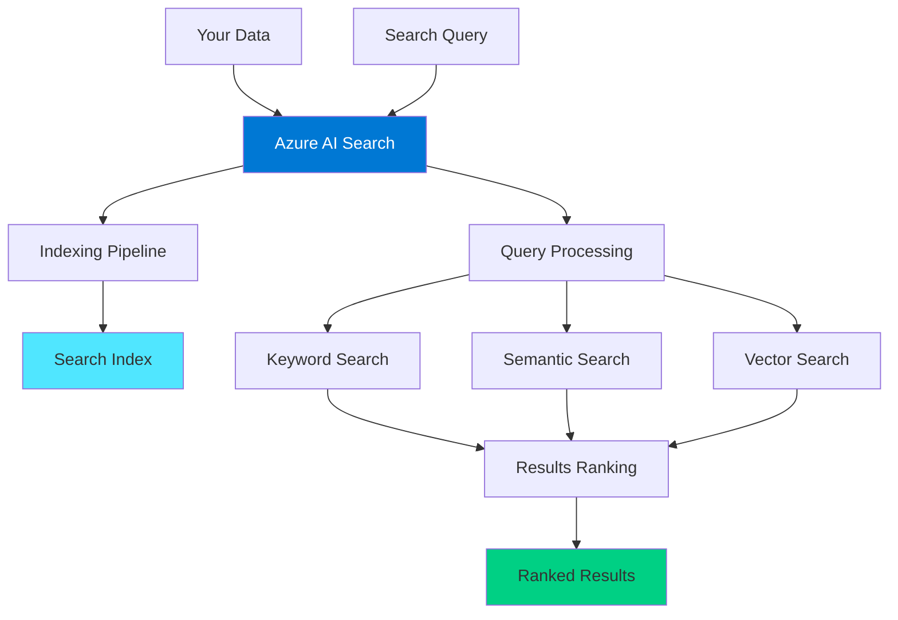

---

## Keyword vs Semantic Search

### Keyword Search (Traditional Full-Text Search)

**How it works**: Matches exact words and their linguistic variations using tokenization and lexical analysis.

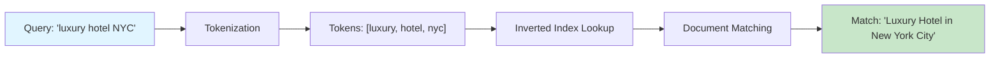

**Characteristics**:
- ✅ Fast and efficient
- ✅ Exact word matching
- ✅ Works with analyzers (stemming, synonyms)
- ❌ No understanding of meaning
- ❌ Misses semantic variations
- ❌ Order matters for proximity

**Example**:
```http
POST /indexes/hotels/docs/search
{
  "search": "luxury hotel with pool",
  "searchFields": "HotelName,Description,Tags",
  "queryType": "full",
  "searchMode": "all"
}
```

**Results**:
```
✅ "Luxury Downtown Hotel with Pool"     - Exact match
✅ "Luxurious Hotel featuring Swimming"  - Stemming: luxury→luxurious
❌ "Upscale Hotel with Swimming Pool"    - Missing "luxury" keyword
❌ "High-end Resort with Aquatic Center" - Synonyms not in analyzer
```

---

### Semantic Search (AI-Powered Understanding)

**How it works**: Uses AI models to understand the meaning and intent of queries, not just keywords.

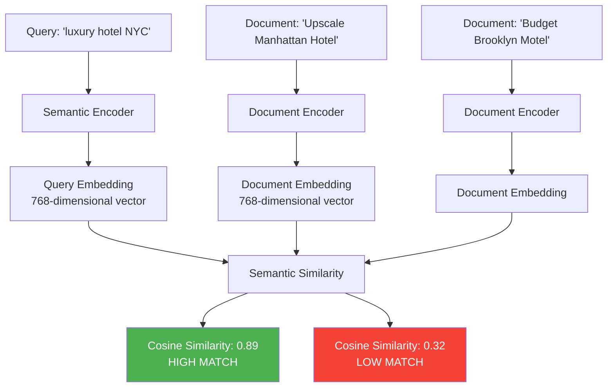

**Characteristics**:
- ✅ Understands meaning and context
- ✅ Matches semantic variations
- ✅ Works with natural language queries
- ✅ Handles synonyms automatically
- ❌ Slightly slower than keyword search
- ❌ Requires semantic configuration

**Example**:
```http
POST /indexes/hotels/docs/search
{
  "search": "luxury hotel with pool",
  "queryType": "semantic",
  "semanticConfiguration": "hotel-semantic-config",
  "answers": "extractive|count-3",
  "captions": "extractive|highlight-true"
}
```

**Results**:
```
✅ "Upscale Manhattan Resort with Aquatic Center"  - Semantic match
✅ "Premium NYC Hotel featuring Swimming Pool"     - Understands premium=luxury
✅ "5-Star Hotel in New York with Pool"           - Understands context
✅ "Luxury Downtown Hotel with Pool"              - Exact match too
```

---

### Keyword vs Semantic: Side-by-Side Comparison

```mermaid
graph TD
    subgraph Keyword Search
    A1[User Query] --> B1[Text Analysis]
    B1 --> C1[Tokenization]
    C1 --> D1[Stemming/Lemmatization]
    D1 --> E1[Inverted Index Lookup]
    E1 --> F1[BM25 Scoring]
    F1 --> G1[Ranked Results]
    end
    
    subgraph Semantic Search
    A2[User Query] --> B2[AI Language Model]
    B2 --> C2[Query Understanding]
    C2 --> D2[Context Extraction]
    D2 --> E2[Semantic Matching]
    E2 --> F2[L2 Re-ranking]
    F2 --> G2[Contextualized Results]
    end
    
    style Keyword Search fill:#E3F2FD
    style Semantic Search fill:#F3E5F5
```

| Feature | Keyword Search | Semantic Search |
|---------|---------------|-----------------|
| **Matching** | Exact words + variations | Meaning + intent |
| **Speed** | Very fast (< 10ms) | Moderate (50-100ms) |
| **Accuracy** | Good for specific terms | Better for natural language |
| **Query Type** | `full` or `simple` | `semantic` |
| **Use Case** | IDs, codes, exact phrases | Natural questions, concepts |
| **Cost** | Included | Additional cost per 1000 queries |
| **Best For** | Structured queries | Conversational queries |

**When to Use What**:

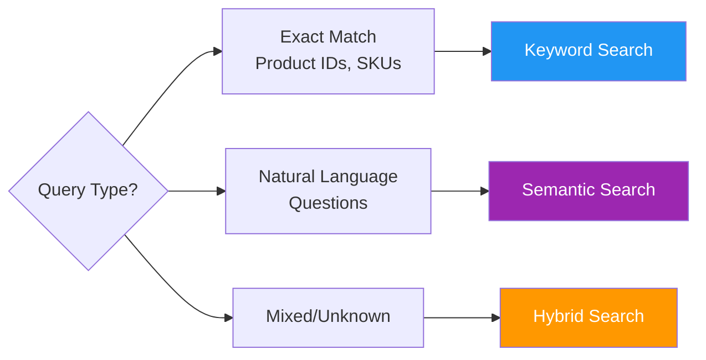

---

## Semantic Search vs Vector Search: Deep Dive

### The Confusion Explained

**Many people confuse these two because they both use AI and understand meaning** - but they work very differently!

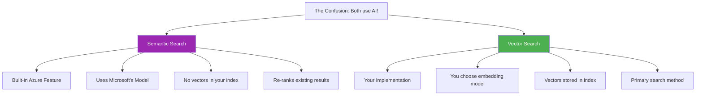

### Key Differences: Semantic vs Vector

| Aspect | Semantic Search | Vector Search |
|--------|----------------|---------------|
| **What it is** | Azure's built-in AI re-ranker | Custom similarity search using embeddings |
| **Index storage** | No vectors needed | Vectors stored in `Collection(Edm.Single)` fields |
| **Setup** | Configure semantic config | Create embeddings + vector fields |
| **When it runs** | After initial search (re-ranking) | Primary search method |
| **Model** | Microsoft's proprietary | Your choice (OpenAI, custom, etc.) |
| **Input** | Regular text fields | Pre-computed vector fields |
| **Output** | Re-ranked results + captions + answers | Similarity-ranked documents |
| **Query type** | `queryType: "semantic"` | `vectorQueries: [...]` |
| **Cost** | Premium tier + per-query | Storage for vectors + embedding costs |

---

### Real Example: Hotel Search Using Your Data

Let's search for: **"cozy place to stay near tourist attractions"**

#### Your Hotel Data:
```json
{
  "HotelId": "1",
  "HotelName": "Stay-Kay City Hotel",
  "Description": "This classic hotel is fully-refurbished and ideally located on the main commercial artery of the city in the heart of New York. A few minutes away is Times Square and the historic centre of the city, as well as other places of interest that make New York one of America's most attractive and cosmopolitan cities.",
  "Category": "Boutique",
  "Tags": ["view", "air conditioning", "concierge"]
}
```

---

### How Each Search Handles This Query

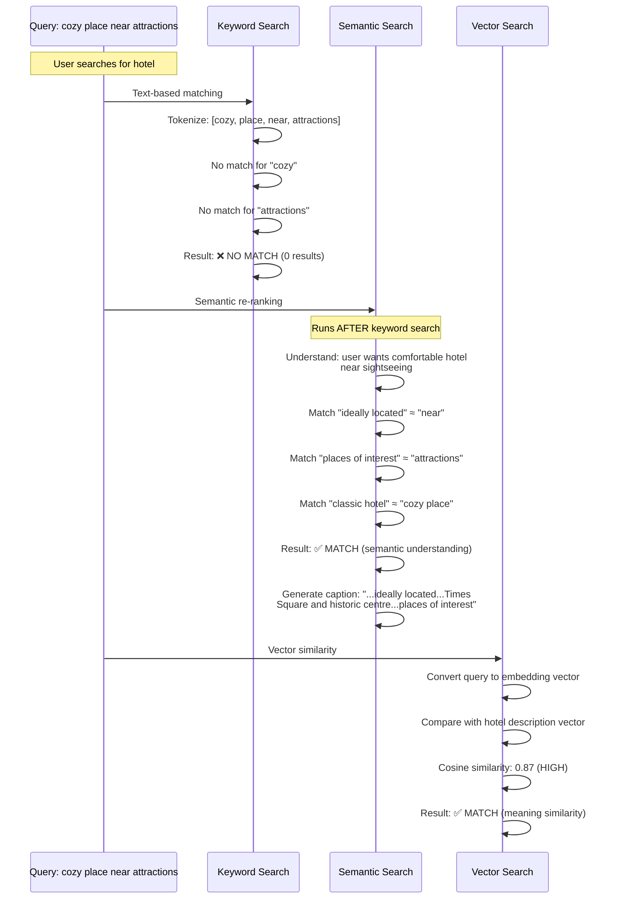

---

### Detailed Breakdown

#### 1️⃣ Keyword Search (Traditional)

```http
POST /indexes/hotels/docs/search
{
  "search": "cozy place to stay near tourist attractions",
  "queryType": "full",
  "searchFields": "Description,HotelName,Tags"
}
```

**How it works:**
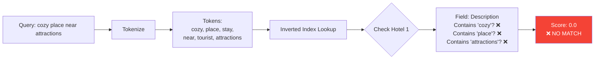

**Result:**
```
❌ No results found
```

**Why it failed:**
- Hotel description uses "classic" not "cozy"
- Uses "places of interest" not "tourist attractions"
- Uses "ideally located" not "near"
- Keyword search only matches exact words (and stems)

---

#### 2️⃣ Semantic Search (Azure Built-in Re-ranker)

```http
POST /indexes/hotels/docs/search
{
  "search": "cozy place to stay near tourist attractions",
  "queryType": "semantic",
  "semanticConfiguration": "hotel-semantic-config",
  "answers": "extractive|count-3",
  "captions": "extractive|highlight-true"
}
```

**How it works:**
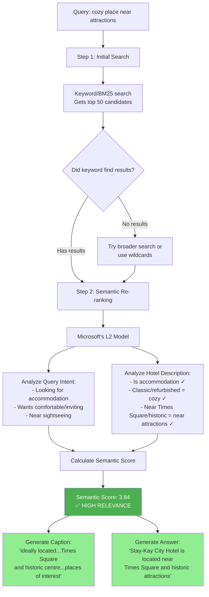

**Result:**
```json
{
  "value": [
    {
      "@search.score": 10.2,         // Original keyword score
      "@search.rerankerScore": 3.84,  // Semantic relevance (0-4 scale)
      "HotelName": "Stay-Kay City Hotel",
      "Description": "This classic hotel is fully-refurbished...",
      
      "@search.captions": [
        {
          "text": "ideally located on the main commercial artery...A few minutes away is Times Square and the historic centre of the city, as well as other places of interest",
          "highlights": "<em>ideally located</em>...Times Square and the historic centre...other <em>places of interest</em>"
        }
      ],
      
      "@search.answers": [
        {
          "text": "Stay-Kay City Hotel is located near Times Square and historic attractions in the heart of New York.",
          "score": 0.89
        }
      ]
    }
  ]
}
```

**Why it succeeded:**
- ✅ Understands "cozy" ≈ "classic" + "fully-refurbished"
- ✅ Understands "near tourist attractions" ≈ "near Times Square and places of interest"
- ✅ Understands "place to stay" = "hotel"
- ✅ Provides highlighted captions
- ✅ Generates direct answer

**Key Point:** Semantic search **requires** an initial search to produce candidates. It doesn't work on an empty result set!

---

#### 3️⃣ Vector Search (Similarity-based)

**First, create vectors during indexing:**

```python
import openai

# Generate embedding for hotel description during indexing
hotel = {
    "HotelId": "1",
    "Description": "This classic hotel is fully-refurbished and ideally located...",
    # ... other fields
}

# Call OpenAI to create embedding
response = openai.Embedding.create(
    model="text-embedding-ada-002",
    input=hotel["Description"]
)

# Store vector in index
hotel["descriptionVector"] = response.data[0].embedding  # [0.23, -0.45, 0.78, ..., 0.12] (1536 numbers)
```

**Schema with vector field:**
```json
{
  "name": "hotels-vector-index",
  "fields": [
    {
      "name": "descriptionVector",
      "type": "Collection(Edm.Single)",
      "dimensions": 1536,
      "vectorSearchProfile": "myProfile"
    }
  ]
}
```

**How vector search works:**

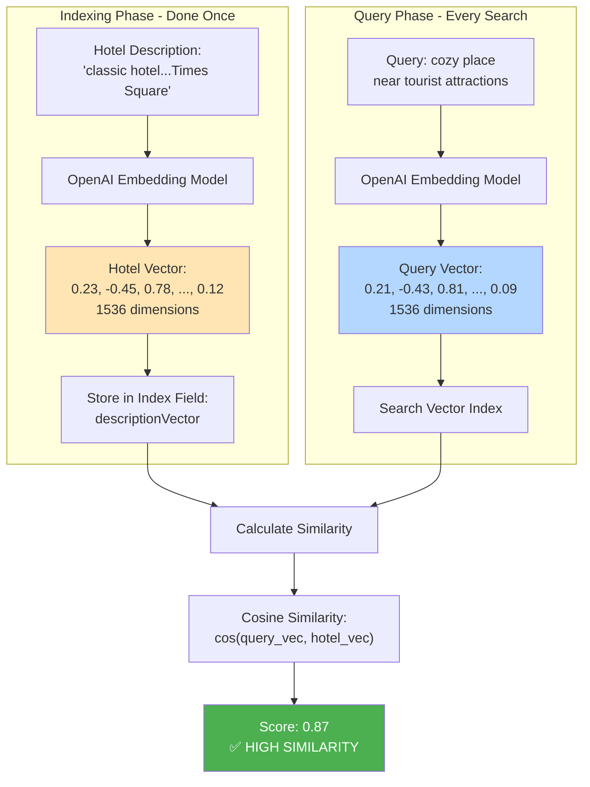

**Query:**
```http
POST /indexes/hotels-vector-index/docs/search
{
  "vectorQueries": [
    {
      "kind": "vector",
      "vector": [0.21, -0.43, 0.81, ..., 0.09],  // Query embedding
      "fields": "descriptionVector",
      "k": 10
    }
  ]
}
```

**Result:**
```json
{
  "value": [
    {
      "@search.score": 0.87,  // Cosine similarity (0-1)
      "HotelName": "Stay-Kay City Hotel",
      "Description": "This classic hotel is fully-refurbished..."
    }
  ]
}
```

**Why it succeeded:**
- ✅ Embeddings capture semantic meaning
- ✅ "cozy" and "classic" have similar vector representations
- ✅ "tourist attractions" and "Times Square/places of interest" are semantically similar
- ✅ Works independently, doesn't need keyword search first

---

### Visual Comparison: All Three Methods

```mermaid
graph TB
    Query["User Query:<br/>cozy place to stay near tourist attractions"]
    
    subgraph KeywordSearch["Keyword Search"]
    KW1[Tokenize query] --> KW2[Search inverted index]
    KW2 --> KW3["Match exact words<br/>cozy: NO<br/>attractions: NO"]
    KW3 --> KW4["Result: NO MATCH"]
    end
    
    subgraph SemanticSearch["Semantic Search"]
    SS1[Keyword search first] --> SS2[Get top 50 results]
    SS2 --> SS3["If empty, broaden search"]
    SS3 --> SS4[Microsoft L2 Re-ranker]
    SS4 --> SS5["Understand intent:<br/>cozy = classic/comfortable<br/>attractions = sightseeing"]
    SS5 --> SS6["Result: MATCH<br/>with Captions and Answers"]
    end
    
    subgraph VectorSearch["Vector Search"]
    VS1[Convert query to vector] --> VS2[1536 dimensions]
    VS2 --> VS3[Compare to hotel vectors]
    VS3 --> VS4["Calculate cosine similarity<br/>Score: 0.87"]
    VS4 --> VS5["Result: MATCH<br/>Sorted by similarity"]
    end
    
    Query --> KeywordSearch
    Query --> SemanticSearch
    Query --> VectorSearch
    
    style KW4 fill:#F44336,color:#fff
    style SS6 fill:#9C27B0,color:#fff
    style VS5 fill:#4CAF50,color:#fff
```

---

### When to Use Each

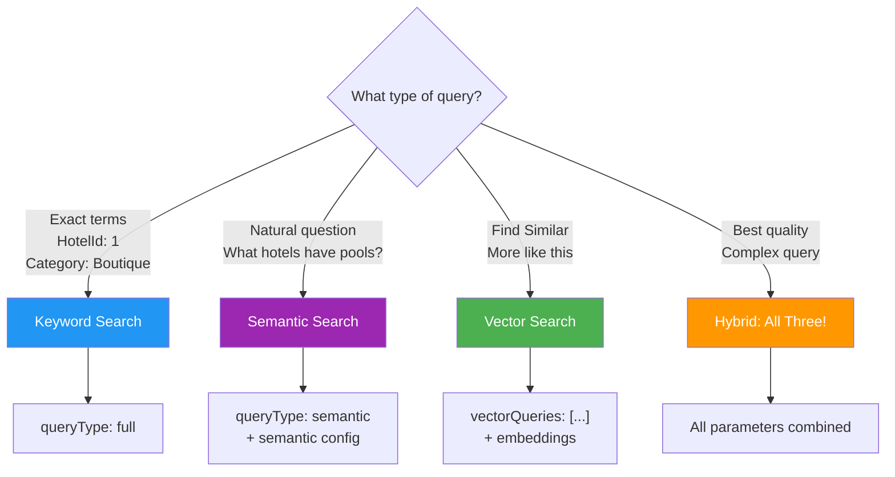

---

### Real Examples from Your Hotel Data

#### Example 1: "Find me a refurbished hotel"

**Keyword Search:**
```http
POST /indexes/hotels/docs/search
{"search": "refurbished"}
```
✅ **Result:** Finds Stay-Kay City Hotel (contains exact word "fully-refurbished")

**Semantic Search:**
```http
POST /indexes/hotels/docs/search
{"search": "recently renovated hotel", "queryType": "semantic"}
```
✅ **Result:** Finds Stay-Kay City Hotel (understands "refurbished" ≈ "renovated")

**Vector Search:**
```http
POST /indexes/hotels/docs/search
{"vectorQueries": [{"vector": embedding_of("modern updated hotel"), "fields": "descriptionVector"}]}
```
✅ **Result:** Finds Stay-Kay City Hotel (semantic similarity to "updated")

---

#### Example 2: "Hotel with Times Square view"

**Your Hotel Data:**
```json
{
  "Description": "...A few minutes away is Times Square and the historic centre of the city...",
  "Rooms": [
    {"Description": "Budget Room, 1 Queen Bed (Cityside)", "Tags": ["vcr/dvd"]}
  ]
}
```

**Keyword Search:**
```http
{"search": "Times Square view"}
```
- ✅ Matches "Times Square" in Description
- ❌ Misses rooms with actual views (no "view" field)
- Score based on term frequency

**Semantic Search:**
```http
{"search": "hotel room overlooking Times Square", "queryType": "semantic"}
```
- ✅ Finds the hotel near Times Square
- ✅ Generates caption: "...A few minutes away is Times Square..."
- ✅ Understands "A few minutes away" ≠ "view of Times Square"
- ⚠️ Captions show context but may clarify hotel is "near" not "view of"

**Vector Search:**
```http
{"vectorQueries": [{"vector": embedding_of("rooms facing Times Square"), "fields": "roomDescriptionVector"}]}
```
- ✅ Finds rooms with geographical/visual similarity
- ✅ Can rank by semantic meaning of descriptors
- Works best with rich room descriptions

---

### The Technical Deep Dive

#### Semantic Search Architecture (Azure Built-in)

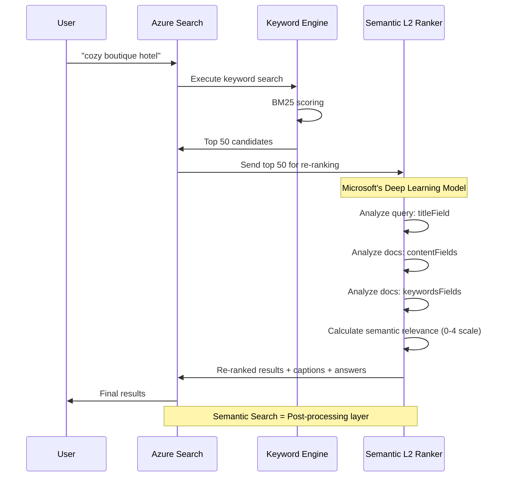

**Configuration Required:**
```json
{
  "semantic": {
    "configurations": [
      {
        "name": "hotel-semantic-config",
        "prioritizedFields": {
          "titleField": {"fieldName": "HotelName"},
          "contentFields": [{"fieldName": "Description"}],
          "keywordsFields": [{"fieldName": "Category"}, {"fieldName": "Tags"}]
        }
      }
    ]
  }
}
```

**No vectors in index!** Semantic search uses your existing text fields.

---

#### Vector Search Architecture (Your Implementation)

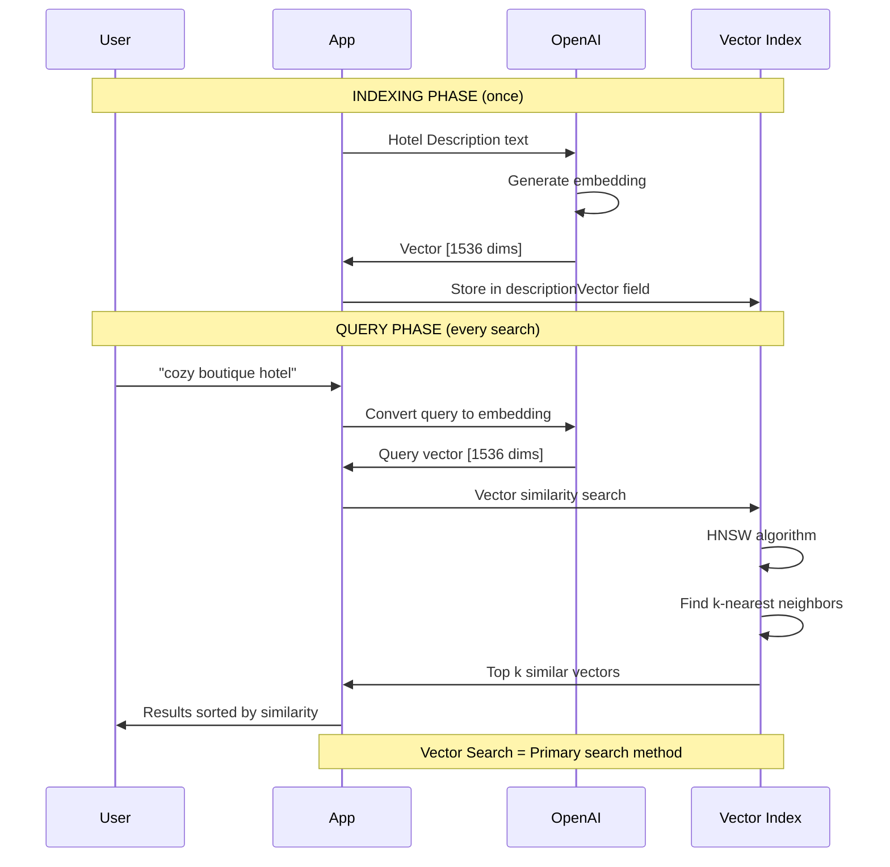

**Configuration Required:**
```json
{
  "fields": [
    {
      "name": "descriptionVector",
      "type": "Collection(Edm.Single)",
      "dimensions": 1536,
      "vectorSearchProfile": "myProfile"
    }
  ],
  "vectorSearch": {
    "profiles": [{
      "name": "myProfile",
      "algorithm": "myHnsw"
    }],
    "algorithms": [{
      "name": "myHnsw",
      "kind": "hnsw"
    }]
  }
}
```

**Vectors stored in index!** You must generate and store embeddings.

---

### Cost Comparison

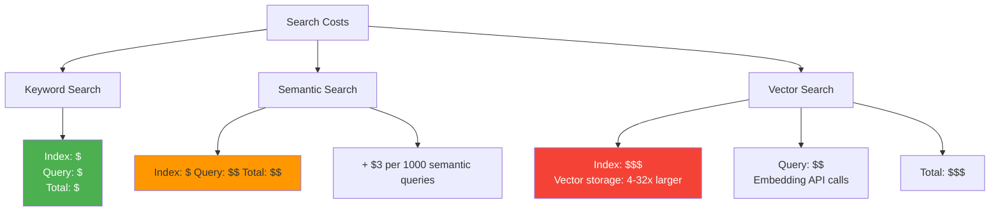

| Cost Factor | Keyword | Semantic | Vector |
|-------------|---------|----------|--------|
| **Index Storage** | Base | Base | Base + vector storage (4x-32x) |
| **Per Query** | Included | +$3 per 1000 queries | Embedding API cost ($0.0001 per 1K tokens) |
| **Infrastructure** | Standard tier | Premium tier required | Standard tier + embedding generator |
| **Monthly Estimate<br/>(10K queries)** | $100 | $130 | $110 + embedding costs |

---

### The Hybrid Approach (Best of All Worlds)

Combine all three for maximum quality!

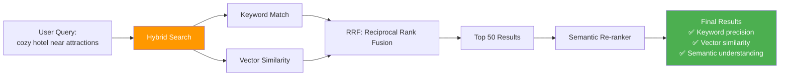

**Query:**
```http
POST /indexes/hotels/docs/search
{
  "search": "cozy place near tourist attractions",
  "queryType": "semantic",
  "semanticConfiguration": "hotel-semantic-config",
  
  "vectorQueries": [{
    "kind": "vector",
    "vector": [0.21, -0.43, ...],
    "fields": "descriptionVector",
    "k": 50
  }],
  
  "scoringProfile": "proximityBoost",
  "top": 10
}
```

**Result:** Best possible relevance combining all methods!

---

### Summary: Quick Decision Guide

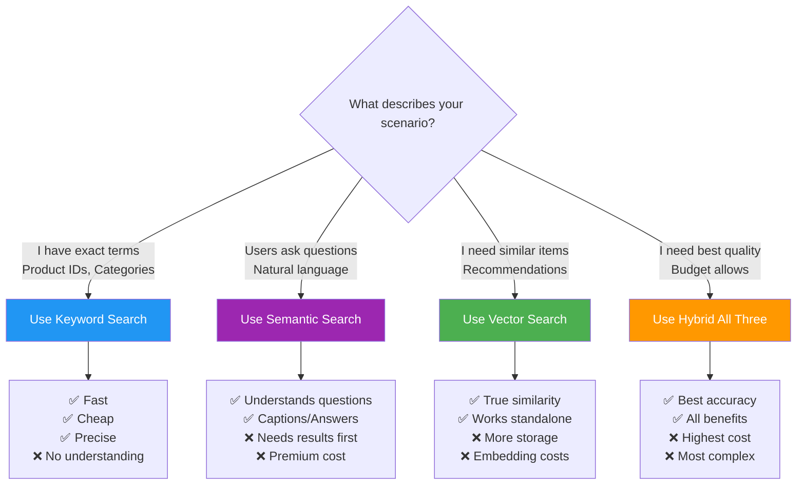

**Simple Rule:**
- **Semantic Search** = Azure re-ranks your search results using AI
- **Vector Search** = You store embeddings and search by mathematical similarity

Both use AI, but in completely different ways!

---

## Vector Search

### What is Vector Search?

Vector search finds similar items based on **semantic similarity** by comparing mathematical representations (embeddings) of text, images, or other data.

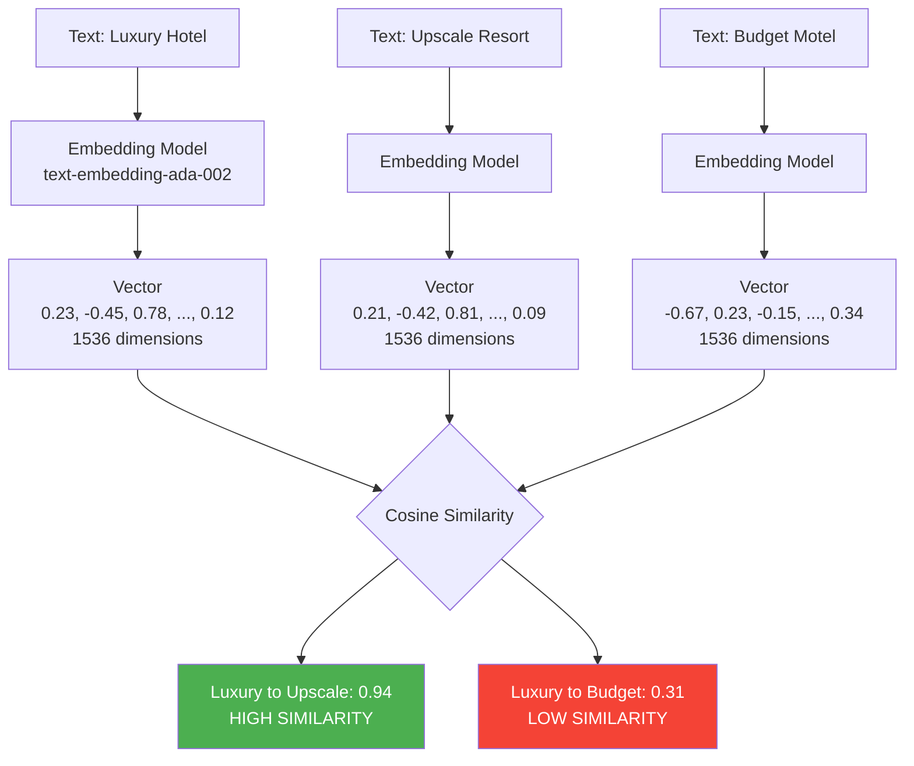

### How Vector Search Works

1. **Indexing Phase**: Convert documents to vectors
2. **Query Phase**: Convert query to vector
3. **Search Phase**: Find nearest neighbors using HNSW/IVF algorithm
4. **Ranking Phase**: Return most similar vectors

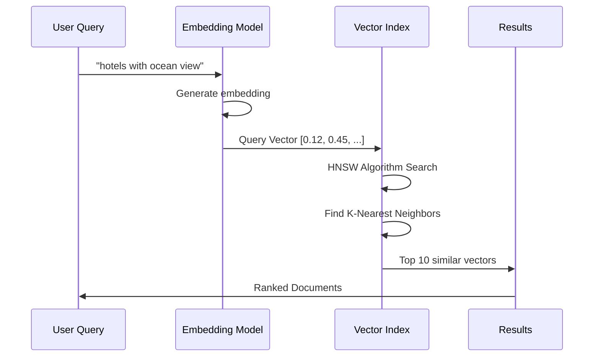

### Vector Search Configuration

```json
{
  "name": "hotels-index",
  "fields": [
    {
      "name": "descriptionVector",
      "type": "Collection(Edm.Single)",
      "searchable": true,
      "dimensions": 1536,
      "vectorSearchProfile": "myProfile"
    },
    {
      "name": "description",
      "type": "Edm.String",
      "searchable": true
    }
  ],
  "vectorSearch": {
    "profiles": [
      {
        "name": "myProfile",
        "algorithm": "myHnsw",
        "vectorizer": "myVectorizer"
      }
    ],
    "algorithms": [
      {
        "name": "myHnsw",
        "kind": "hnsw",
        "hnswParameters": {
          "m": 4,
          "efConstruction": 400,
          "efSearch": 500,
          "metric": "cosine"
        }
      }
    ],
    "vectorizers": [
      {
        "name": "myVectorizer",
        "kind": "azureOpenAI",
        "azureOpenAIParameters": {
          "resourceUri": "https://my-openai.openai.azure.com",
          "deploymentId": "text-embedding-ada-002",
          "apiKey": "${api-key}"
        }
      }
    ]
  }
}
```

### Vector Search Query

```http
POST /indexes/hotels/docs/search
{
  "vectorQueries": [
    {
      "kind": "vector",
      "vector": [0.12, 0.45, 0.78, ...],  // 1536 dimensions
      "fields": "descriptionVector",
      "k": 10,
      "exhaustive": false
    }
  ],
  "select": "HotelName, Description, Rating"
}
```

### Vector Search Algorithms

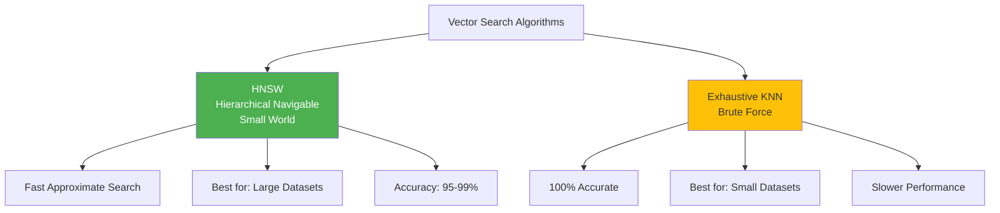

**HNSW Parameters Explained**:

| Parameter | Description | Impact | Recommended |
|-----------|-------------|--------|-------------|
| `m` | Connections per node | Higher = better recall, more memory | 4-16 |
| `efConstruction` | Build-time effort | Higher = better graph, slower indexing | 400-800 |
| `efSearch` | Query-time effort | Higher = better accuracy, slower queries | 500-1000 |
| `metric` | Distance function | `cosine`, `euclidean`, `dotProduct` | `cosine` |

---

## Vector Profiles

### What are Vector Profiles?

Vector profiles define **how vectors are indexed and searched**. They combine:
1. **Algorithm** (HNSW, Exhaustive KNN)
2. **Vectorizer** (How to generate embeddings)
3. **Compression** (Optional: Scalar/Binary quantization)

```mermaid
graph TD
    A[Vector Profile] --> B[Algorithm Configuration]
    A --> C[Vectorizer Configuration]
    A --> D[Compression Settings]
    
    B --> B1[HNSW Parameters]
    B --> B2[Exhaustive KNN]
    
    C --> C1[Azure OpenAI]
    C --> C2[Custom Endpoint]
    C --> C3[None - Pre-computed]
    
    D --> D1[Scalar Quantization]
    D --> D2[Binary Quantization]
    D --> D3[No Compression]
    
    style A fill:#0078D4,color:#fff
    style B1 fill:#50E6FF
    style C1 fill:#50E6FF
    style D1 fill:#50E6FF
```

### Complete Vector Profile Example

```json
{
  "vectorSearch": {
    // 1️⃣ PROFILES: Named configurations
    "profiles": [
      {
        "name": "highAccuracyProfile",
        "algorithm": "accurateHnsw",
        "vectorizer": "azureOpenAI",
        "compression": "scalarQuantization"
      },
      {
        "name": "fastSearchProfile",
        "algorithm": "fastHnsw",
        "vectorizer": "azureOpenAI",
        "compression": "binaryQuantization"
      }
    ],
    
    // 2️⃣ ALGORITHMS: How to organize vectors
    "algorithms": [
      {
        "name": "accurateHnsw",
        "kind": "hnsw",
        "hnswParameters": {
          "m": 8,                    // More connections
          "efConstruction": 800,      // Better build quality
          "efSearch": 1000,           // Better search quality
          "metric": "cosine"
        }
      },
      {
        "name": "fastHnsw",
        "kind": "hnsw",
        "hnswParameters": {
          "m": 4,                    // Fewer connections
          "efConstruction": 400,      // Faster build
          "efSearch": 500,            // Faster search
          "metric": "cosine"
        }
      }
    ],
    
    // 3️⃣ VECTORIZERS: How to generate embeddings
    "vectorizers": [
      {
        "name": "azureOpenAI",
        "kind": "azureOpenAI",
        "azureOpenAIParameters": {
          "resourceUri": "https://my-openai.openai.azure.com",
          "deploymentId": "text-embedding-ada-002",
          "modelName": "text-embedding-ada-002",
          "apiKey": "${openai-api-key}"
        }
      }
    ],
    
    // 4️⃣ COMPRESSION: Reduce storage and improve speed
    "compressions": [
      {
        "name": "scalarQuantization",
        "kind": "scalar",
        "scalarQuantizationParameters": {
          "quantizedDataType": "int8"  // 4x smaller, slight accuracy loss
        }
      },
      {
        "name": "binaryQuantization",
        "kind": "binary",
        "rerankWithOriginalVectors": true,  // Better accuracy
        "defaultOversampling": 10
      }
    ]
  }
}
```

### Vector Profile Decision Tree

```mermaid
graph TD
    A{Choose Vector Profile} --> B{Dataset Size?}
    
    B -->|< 100K docs| C[Exhaustive KNN<br/>100% Accuracy]
    B -->|> 100K docs| D{Priority?}
    
    D -->|Speed| E[Fast HNSW<br/>m=4, ef=500]
    D -->|Accuracy| F[Accurate HNSW<br/>m=8, ef=1000]
    D -->|Balanced| G[Standard HNSW<br/>m=6, ef=700]
    
    E --> H{Storage Cost?}
    F --> H
    G --> H
    
    H -->|Concern| I[Binary Quantization<br/>32x smaller]
    H -->|Not Critical| J[Scalar Quantization<br/>4x smaller]
    H -->|No Compression| K[Full Precision]
    
    style C fill:#4CAF50,color:#fff
    style E fill:#2196F3,color:#fff
    style F fill:#9C27B0,color:#fff
    style I fill:#FF9800,color:#fff
```

### Compression Comparison

| Compression | Size Reduction | Accuracy Impact | Speed Impact | Use Case |
|-------------|---------------|-----------------|--------------|----------|
| **None** | 1x (baseline) | 100% | 1x | Small datasets, accuracy critical |
| **Scalar (int8)** | 4x smaller | 98-99% | 1.5x faster | Balanced approach |
| **Binary** | 32x smaller | 95-97% | 3x faster | Large datasets, speed critical |

---

## Scoring Profiles

### What are Scoring Profiles?

Scoring profiles **customize relevance ranking** by boosting specific fields, freshness, magnitude, distance, or tags.

```mermaid
graph LR
    A[Search Query] --> B[Base Score<br/>BM25/Vector]
    B --> C[Scoring Profile]
    
    C --> D[Text Weights<br/>Boost Important Fields]
    C --> E[Freshness Function<br/>Boost Recent Items]
    C --> F[Magnitude Function<br/>Boost High Values]
    C --> G[Distance Function<br/>Boost Nearby Items]
    C --> H[Tag Boost<br/>Boost Specific Tags]
    
    D --> I[Final Score]
    E --> I
    F --> I
    G --> I
    H --> I
    
    I --> J[Re-ranked Results]
    
    style C fill:#FF9800,color:#fff
    style I fill:#4CAF50,color:#fff
```

### Scoring Profile Example

```json
{
  "scoringProfiles": [
    {
      "name": "premiumHotelsProfile",
      
      // 1️⃣ TEXT WEIGHTS: Boost specific fields
      "text": {
        "weights": {
          "HotelName": 3.0,        // Hotel name most important
          "Description": 2.0,       // Description second
          "Tags": 1.5,             // Tags helpful
          "Category": 1.0          // Category baseline
        }
      },
      
      // 2️⃣ FUNCTIONS: Dynamic boosting
      "functions": [
        {
          // FRESHNESS: Boost recently renovated hotels
          "type": "freshness",
          "fieldName": "LastRenovationDate",
          "boost": 5.0,
          "interpolation": "linear",
          "freshness": {
            "boostingDuration": "P730D"  // Boost within 2 years
          }
        },
        {
          // MAGNITUDE: Boost high-rated hotels
          "type": "magnitude",
          "fieldName": "Rating",
          "boost": 3.0,
          "interpolation": "logarithmic",
          "magnitude": {
            "boostingRangeStart": 4.0,
            "boostingRangeEnd": 5.0,
            "constantBoostBeyondRange": false
          }
        },
        {
          // DISTANCE: Boost nearby hotels
          "type": "distance",
          "fieldName": "Location",
          "boost": 2.0,
          "interpolation": "linear",
          "distance": {
            "referencePointParameter": "currentLocation",
            "boostingDistance": 10  // Boost within 10km
          }
        },
        {
          // TAG: Boost specific amenities
          "type": "tag",
          "fieldName": "Tags",
          "boost": 4.0,
          "tag": {
            "tagsParameter": "preferredAmenities"
          }
        }
      ],
      
      // 3️⃣ FUNCTION AGGREGATION
      "functionAggregation": "sum"  // sum, average, minimum, maximum, firstMatching
    }
  ]
}
```

### How Scoring Works

```mermaid
sequenceDiagram
    participant Q as Query
    participant S as Search Engine
    participant B as Base Scoring
    participant P as Scoring Profile
    participant R as Results
    
    Q->>S: "luxury hotel"
    S->>B: Calculate base score (BM25)
    B->>S: Hotel A: 10.5, Hotel B: 8.3
    
    S->>P: Apply scoring profile
    P->>P: Text weights: +2.0
    P->>P: Freshness boost: +1.5
    P->>P: Rating boost: +3.0
    P->>P: Distance boost: +0.5
    
    P->>S: Final scores
    S->>R: Hotel A: 17.5, Hotel B: 12.8
    R->>Q: Ranked results
```

### Scoring Functions Explained

#### 1. Freshness Function

```mermaid
graph LR
    A[Document Date] --> B{Within Boosting Duration?}
    B -->|Yes| C[Calculate Age Score]
    B -->|No| D[No Boost]
    
    C --> E[Linear Decay]
    E --> F[Recent = Full Boost]
    E --> G[Older = Less Boost]
    
    style F fill:#4CAF50,color:#fff
    style G fill:#FF9800
```

```json
{
  "type": "freshness",
  "fieldName": "LastRenovationDate",
  "boost": 5.0,
  "freshness": {
    "boostingDuration": "P730D"  // ISO 8601: 730 days
  }
}
```

**Example**:
- Hotel renovated yesterday: `+5.0 boost`
- Hotel renovated 1 year ago: `+2.5 boost`
- Hotel renovated 2 years ago: `+0.5 boost`
- Hotel renovated 3 years ago: `+0.0 boost`

#### 2. Magnitude Function

```mermaid
graph LR
    A[Field Value] --> B{Within Range?}
    B -->|Yes| C[Scale Boost]
    B -->|Below| D[No/Constant Boost]
    B -->|Above| E[Full Boost]
    
    C --> F[Interpolation]
    F --> G[Linear/Logarithmic]
    
    style E fill:#4CAF50,color:#fff
```

```json
{
  "type": "magnitude",
  "fieldName": "Rating",
  "boost": 3.0,
  "magnitude": {
    "boostingRangeStart": 4.0,
    "boostingRangeEnd": 5.0
  }
}
```

**Example** (Rating field):
- Rating 5.0: `+3.0 boost` (full)
- Rating 4.5: `+1.5 boost` (50% of range)
- Rating 4.0: `+0.0 boost` (start of range)
- Rating 3.5: `+0.0 boost` (below range)

#### 3. Distance Function

```mermaid
graph TD
    A[User Location] --> B[Calculate Distance]
    C[Hotel Location] --> B
    
    B --> D{Within Boosting Distance?}
    D -->|Yes| E[Apply Boost]
    D -->|No| F[No Boost]
    
    E --> G[Nearby = Full Boost]
    E --> H[Far = Less Boost]
    
    style G fill:#4CAF50,color:#fff
```

```json
{
  "type": "distance",
  "fieldName": "Location",
  "boost": 2.0,
  "distance": {
    "referencePointParameter": "currentLocation",
    "boostingDistance": 10  // kilometers
  }
}
```

**Example**:
```http
POST /indexes/hotels/docs/search
{
  "search": "hotel",
  "scoringProfile": "premiumHotelsProfile",
  "scoringParameters": ["currentLocation:-73.975,40.760"]
}
```

- Hotel 1km away: `+2.0 boost`
- Hotel 5km away: `+1.0 boost`
- Hotel 10km away: `+0.0 boost`
- Hotel 15km away: `+0.0 boost`

#### 4. Tag Function

```json
{
  "type": "tag",
  "fieldName": "Tags",
  "boost": 4.0,
  "tag": {
    "tagsParameter": "preferredAmenities"
  }
}
```

**Example**:
```http
POST /indexes/hotels/docs/search
{
  "search": "hotel",
  "scoringProfile": "premiumHotelsProfile",
  "scoringParameters": ["preferredAmenities-pool,spa,gym"]
}
```

- Hotel with all 3 tags: `+12.0 boost` (4.0 × 3)
- Hotel with 2 tags: `+8.0 boost` (4.0 × 2)
- Hotel with 1 tag: `+4.0 boost` (4.0 × 1)
- Hotel with 0 tags: `+0.0 boost`

### Using Scoring Profiles

```http
POST /indexes/hotels/docs/search
{
  "search": "luxury hotel",
  "scoringProfile": "premiumHotelsProfile",
  "scoringParameters": [
    "currentLocation:-73.975,40.760",
    "preferredAmenities-pool,spa,gym"
  ],
  "top": 10
}
```

---

## Semantic Rankers

### What is Semantic Ranking?

Semantic ranking uses **Microsoft's deep learning models** to re-rank search results based on semantic relevance to the query.

```mermaid
graph TD
    A[User Query:<br/>'family vacation hotel'] --> B[Initial Search]
    B --> C[Keyword/Vector Search]
    C --> D[Top 50 Results]
    
    D --> E[Semantic Ranker<br/>L2 Re-ranking]
    
    E --> F[Deep Learning Model]
    F --> G[Analyze Query Intent]
    F --> H[Extract Document Meaning]
    F --> I[Calculate Semantic Relevance]
    
    I --> J[Re-ranked Top 50]
    J --> K[Generate Captions]
    J --> L[Generate Answers]
    
    K --> M[Highlighted Snippets]
    L --> N[Direct Answers]
    
    style E fill:#9C27B0,color:#fff
    style M fill:#4CAF50,color:#fff
    style N fill:#4CAF50,color:#fff
```

### Semantic Configuration

```json
{
  "semantic": {
    "configurations": [
      {
        "name": "hotel-semantic-config",
        "prioritizedFields": {
          // Most important for semantic understanding
          "titleField": {
            "fieldName": "HotelName"
          },
          
          // Rich content for semantic analysis
          "contentFields": [
            { "fieldName": "Description" },
            { "fieldName": "Description_fr" }
          ],
          
          // Important keywords/categories
          "keywordsFields": [
            { "fieldName": "Category" },
            { "fieldName": "Tags" },
            { "fieldName": "Address/City" }
          ]
        }
      }
    ]
  }
}
```

### Semantic Search Query

```http
POST /indexes/hotels/docs/search
{
  "search": "pet-friendly hotel near central park with room service",
  
  // Enable semantic search
  "queryType": "semantic",
  "semanticConfiguration": "hotel-semantic-config",
  
  // Request answers (direct responses)
  "answers": "extractive|count-3",
  
  // Request captions (highlighted snippets)
  "captions": "extractive|highlight-true",
  
  "select": "HotelName, Description, Category, Rating",
  "top": 10
}
```

### Semantic Response

```json
{
  "value": [
    {
      "@search.score": 42.5,
      "@search.rerankerScore": 3.841,  // Semantic relevance score
      "HotelName": "The Central Park Hotel",
      "Description": "Elegant hotel adjacent to Central Park...",
      
      // CAPTION: Relevant snippet with highlights
      "@search.captions": [
        {
          "text": "pet-friendly accommodations with <em>24-hour room service</em>",
          "highlights": "pet-friendly accommodations with <em>24-hour room service</em>"
        }
      ]
    }
  ],
  
  // ANSWERS: Direct answers to the query
  "@search.answers": [
    {
      "key": "1",
      "text": "The Central Park Hotel offers pet-friendly rooms within walking distance of Central Park and provides 24-hour room service.",
      "highlights": "The Central Park Hotel offers <em>pet-friendly</em> rooms within walking distance of <em>Central Park</em> and provides 24-hour <em>room service</em>.",
      "score": 0.95
    }
  ]
}
```

### Semantic Ranker Architecture

```mermaid
graph LR
    subgraph "Phase 1: Initial Retrieval"
    A[Query] --> B[Keyword/Vector Search]
    B --> C[Top 50 Candidates]
    end
    
    subgraph "Phase 2: Semantic Re-ranking"
    C --> D[Title Analysis]
    C --> E[Content Analysis]
    C --> F[Keywords Analysis]
    
    D --> G[Semantic Model]
    E --> G
    F --> G
    
    G --> H[Relevance Scores]
    end
    
    subgraph "Phase 3: Result Enhancement"
    H --> I[Generate Captions]
    H --> J[Generate Answers]
    
    I --> K[Highlighted Snippets]
    J --> L[Direct Answers]
    end
    
    K --> M[Final Results]
    L --> M
    
    style G fill:#9C27B0,color:#fff
    style M fill:#4CAF50,color:#fff
```

### When to Use Semantic Ranker

```mermaid
graph TD
    A{Query Characteristics} --> B[Natural Language?]
    A --> C[Specific Keywords?]
    
    B --> D[✅ Use Semantic Ranker]
    C --> E[❌ Keyword Search Sufficient]
    
    D --> F[Examples:<br/>- What hotels are near museums?<br/>- Find romantic getaway spots<br/>- Hotels good for business travel]
    
    E --> G[Examples:<br/>- Hotel ID: 12345<br/>- Manhattan Boutique<br/>- Category: Resort]
    
    style D fill:#4CAF50,color:#fff
    style E fill:#2196F3,color:#fff
```

**Use Semantic Ranker for**:
- ✅ Natural language questions
- ✅ Conversational queries
- ✅ Complex intent ("business trip with family")
- ✅ When captions/answers needed

**Skip Semantic Ranker for**:
- ❌ Simple keyword searches
- ❌ ID/SKU lookups
- ❌ High-volume, low-complexity queries
- ❌ Cost-sensitive scenarios (semantic = premium)

---

## CORS Configuration

### What is CORS?

**CORS** (Cross-Origin Resource Sharing) controls which web domains can call your Azure AI Search service from JavaScript.

```mermaid
graph LR
    A[Browser at<br/>myapp.com] --> B{CORS Check}
    
    B -->|Allowed Origin| C[✅ Allow Request]
    B -->|Not Allowed| D[❌ Block Request]
    
    C --> E[Azure AI Search]
    E --> F[Return Results]
    F --> A
    
    D --> G[CORS Error]
    
    style C fill:#4CAF50,color:#fff
    style D fill:#F44336,color:#fff
```

### Why CORS Matters

Without CORS, browser blocks cross-origin requests:

```
🌐 Your App: https://myhotelapp.com
☁️ Azure Search: https://myservice.search.windows.net

❌ Browser: "Blocked by CORS policy: No 'Access-Control-Allow-Origin' header"
```

### CORS Configuration

```http
PUT https://myservice.search.windows.net?api-version=2023-11-01
Content-Type: application/json
api-key: your-admin-key

{
  "corsOptions": {
    "allowedOrigins": [
      "https://myhotelapp.com",
      "https://www.myhotelapp.com",
      "http://localhost:3000"           // Development
    ],
    "maxAgeInSeconds": 3600              // Cache preflight for 1 hour
  }
}
```

### CORS Options

| Pattern | Description | Example |
|---------|-------------|---------|
| **Specific domain** | Single allowed origin | `https://myapp.com` |
| **Multiple domains** | List of origins | `["https://app1.com", "https://app2.com"]` |
| **Wildcard (all)** | Allow all origins | `["*"]` ⚠️ Not recommended for production |
| **Localhost** | Development testing | `http://localhost:3000` |
| **Subdomain** | Include subdomains | `https://search.myapp.com` |

### CORS Security Best Practices

```mermaid
graph TD
    A[CORS Security] --> B[✅ DO]
    A --> C[❌ DON'T]
    
    B --> B1[List specific domains]
    B --> B2[Use HTTPS in production]
    B --> B3[Include only necessary origins]
    B --> B4[Use query keys, not admin keys]
    
    C --> C1[Use wildcard in production]
    C --> C2[Mix HTTP and HTTPS]
    C --> C3[Expose admin keys to browser]
    C --> C4[Allow all origins]
    
    style B fill:#4CAF50,color:#fff
    style C fill:#F44336,color:#fff
```

**Good CORS Setup**:
```json
{
  "corsOptions": {
    "allowedOrigins": [
      "https://myapp.com",
      "https://www.myapp.com"
    ],
    "maxAgeInSeconds": 3600
  }
}
```

**Bad CORS Setup** (⚠️ Security Risk):
```json
{
  "corsOptions": {
    "allowedOrigins": ["*"],  // ❌ Anyone can query your index
    "maxAgeInSeconds": 86400
  }
}
```

### CORS Troubleshooting

```mermaid
flowchart TD
    A[CORS Error?] --> B{Check Origin}
    B --> C[Is origin in allowedOrigins?]
    
    C -->|No| D[Add origin to CORS config]
    C -->|Yes| E{Check Protocol}
    
    E --> F[HTTP vs HTTPS match?]
    F -->|No| G[Fix protocol mismatch]
    F -->|Yes| H{Check API Key}
    
    H --> I[Using query key not admin?]
    I -->|No| J[Switch to query key]
    I -->|Yes| K{Check Browser Console}
    
    K --> L[Preflight failed?]
    L --> M[Check maxAgeInSeconds]
    
    style D fill:#FF9800,color:#fff
    style G fill:#FF9800,color:#fff
    style J fill:#FF9800,color:#fff
```

---

## RAG Patterns

### What is RAG?

**RAG** (Retrieval-Augmented Generation) combines search with large language models to provide accurate, grounded responses.

```mermaid
graph LR
    A[User Question] --> B[Search Index]
    B --> C[Retrieve Relevant Docs]
    C --> D[LLM with Context]
    D --> E[Generated Answer]
    
    style B fill:#2196F3,color:#fff
    style D fill:#9C27B0,color:#fff
    style E fill:#4CAF50,color:#fff
```

### Classic RAG Architecture

```mermaid
sequenceDiagram
    participant U as User
    participant A as Application
    participant S as Azure AI Search
    participant L as Azure OpenAI
    
    U->>A: "What hotels have pools?"
    A->>S: Vector search query
    S->>S: Find relevant documents
    S->>A: Top 5 hotels with pools
    
    A->>A: Build prompt with search results
    A->>L: Prompt + Context
    
    Note over L: Generate answer using<br/>grounded context
    
    L->>A: "Based on your search,<br/>3 hotels have pools..."
    A->>U: Answer with citations
```

### RAG Implementation Example

```python
import openai
from azure.search.documents import SearchClient

# 1️⃣ Search for relevant documents
search_client = SearchClient(
    endpoint="https://myservice.search.windows.net",
    index_name="hotels",
    credential=AzureKeyCredential(key)
)

results = search_client.search(
    search_text="hotels with pool and spa",
    query_type="semantic",
    semantic_configuration_name="hotel-semantic-config",
    top=5
)

# 2️⃣ Build context from search results
context = "\n\n".join([
    f"Hotel: {doc['HotelName']}\n{doc['Description']}"
    for doc in results
])

# 3️⃣ Generate answer with LLM
messages = [
    {
        "role": "system",
        "content": "You are a helpful hotel assistant. Use only the provided context to answer questions."
    },
    {
        "role": "user",
        "content": f"Context:\n{context}\n\nQuestion: What hotels have pools and spas?"
    }
]

response = openai.ChatCompletion.create(
    model="gpt-4",
    messages=messages,
    temperature=0.3
)

answer = response.choices[0].message.content
```

### RAG Variations

```mermaid
graph TD
    A[RAG Patterns] --> B[Basic RAG]
    A --> C[Hybrid RAG]
    A --> D[Multi-Query RAG]
    A --> E[Iterative RAG]
    A --> F[Agentic RAG]
    
    B --> B1[Single search + LLM]
    C --> C1[Keyword + Vector + Semantic]
    D --> D1[Multiple searches, combine]
    E --> E1[Refine query based on results]
    F --> F1[Agent decides search strategy]
    
    style F fill:#FF9800,color:#fff
```

---

## Agentic RAG Search: Deep Dive

### The Confusion: What Makes RAG "Agentic"?

Many developers are confused about what "Agentic" means in RAG. Let's break it down:

```mermaid
graph TB
    A["The Confusion:<br/>What is Agentic RAG?"] --> B["Classic RAG<br/>You Control Everything"]
    A --> C["Agentic RAG<br/>AI Agent Controls Itself"]
    
    B --> B1["Fixed workflow"]
    B --> B2["Single search query"]
    B --> B3["Predetermined logic"]
    B --> B4["No planning"]
    
    C --> C1["Dynamic workflow"]
    C --> C2["Multiple adaptive queries"]
    C --> C3["AI-driven decisions"]
    C --> C4["Autonomous planning"]
    
    style B fill:#2196F3,color:#fff
    style C fill:#FF9800,color:#fff
```

**Simple Definition:**
- **Classic RAG**: You write code that says "search for X, then send results to LLM"
- **Agentic RAG**: AI agent decides what to search, when, how many times, and how to combine results

---

### Real-World Example: Hotel Search Using Your Data

Let's use a complex query that shows why we need Agentic RAG:

**User Query:** *"I need a family-friendly hotel in New York with pool and spa amenities, budget under $200 per night, near Times Square, and recently renovated. Compare options."*

#### Your Hotel Data:
```json
{
  "HotelId": "1",
  "HotelName": "Stay-Kay City Hotel",
  "Description": "This classic hotel is fully-refurbished and ideally located on the main commercial artery of the city in the heart of New York. A few minutes away is Times Square and the historic centre of the city.",
  "Category": "Boutique",
  "Tags": ["view", "air conditioning", "concierge"],
  "Rating": 3.60,
  "LastRenovationDate": "2022-01-18T00:00:00Z",
  "Address": {
    "City": "New York",
    "StateProvince": "NY"
  },
  "Location": {
    "coordinates": [-73.975403, 40.760586]
  },
  "Rooms": [
    {
      "Type": "Budget Room",
      "BaseRate": 96.99,
      "SleepsCount": 2,
      "Tags": ["vcr/dvd"]
    },
    {
      "Type": "Deluxe Room",
      "BaseRate": 150.99,
      "SleepsCount": 2,
      "Tags": ["suite", "bathroom shower", "coffee maker"]
    },
    {
      "Type": "Suite",
      "BaseRate": 243.99,
      "SleepsCount": 4,
      "Tags": ["Room Tags"]
    }
  ]
}
```

---

### Classic RAG vs Agentic RAG: Side-by-Side

#### ❌ Classic RAG: Fixed Workflow

```mermaid
sequenceDiagram
    participant U as User
    participant C as Your Code
    participant S as Azure Search
    participant L as LLM
    
    U->>C: Complex multi-part query
    
    Note over C: You must manually<br/>parse the query
    
    C->>S: Single search query
    Note over C,S: Search: "family hotel New York pool spa"
    
    S->>C: 5 results (might not match all criteria)
    
    C->>L: Build prompt with results
    L->>C: Generate answer
    
    C->>U: ❌ Answer might miss criteria:<br/>- Budget check?<br/>- Location distance?<br/>- Renovation date?
    
    Note over U,C: User must ask again if incomplete
```

**Classic RAG Code:**
```python
# ❌ Classic RAG: You do all the thinking

def classic_rag(query):
    # 1. You manually decide what to search
    results = search_client.search(query, top=5)
    
    # 2. You build the context (no filtering, no validation)
    context = "\n".join([doc['Description'] for doc in results])
    
    # 3. Send to LLM
    answer = openai.ChatCompletion.create(
        model="gpt-4",
        messages=[
            {"role": "system", "content": "Answer using context"},
            {"role": "user", "content": f"Context:\n{context}\n\nQuestion: {query}"}
        ]
    )
    
    return answer.choices[0].message.content

# ❌ Problems:
# - What if results don't match budget?
# - What if no hotels near Times Square?
# - What if need to compare multiple searches?
# - No validation or refinement
```

---

#### ✅ Agentic RAG: Autonomous Planning

```mermaid
sequenceDiagram
    participant U as User
    participant A as AI Agent
    participant S as Azure Search
    participant L as LLM Brain
    
    U->>A: Complex multi-part query
    
    A->>L: Analyze query
    L->>A: Plan: Need 5 searches
    
    Note over A: 🤔 Agent Planning:<br/>1. Location filter (NYC + proximity)<br/>2. Amenity search (pool, spa)<br/>3. Price filter ($0-200)<br/>4. Date filter (recent renovation)<br/>5. Family-friendly (sleeps 4+)
    
    A->>S: Search 1: Hotels in NYC
    S->>A: 50 NYC hotels
    
    A->>S: Search 2: Filter by geo proximity to Times Square
    S->>A: 15 hotels within 2km
    
    A->>S: Search 3: Filter by tags: pool, spa
    S->>A: 8 hotels with amenities
    
    A->>S: Search 4: Filter rooms by price < 200
    S->>A: 5 hotels in budget
    
    A->>S: Search 5: Filter by LastRenovationDate > 2020
    S->>A: 3 recently renovated hotels
    
    A->>A: 💡 Synthesize:<br/>- Compare amenities<br/>- Compare prices<br/>- Check distance<br/>- Validate all criteria
    
    A->>L: Generate structured comparison
    L->>A: Comparison table + recommendations
    
    A->>A: ✅ Validate:<br/>- All criteria met?<br/>- Citations accurate?<br/>- Logical answer?
    
    A->>U: ✅ Complete answer with:<br/>- Multiple hotel options<br/>- Comparison table<br/>- Meets all criteria<br/>- Cited sources
    
    Note over U,A: Single interaction!
```

**Agentic RAG Code:**
```python
# ✅ Agentic RAG: Agent does the thinking

from langchain.agents import AgentExecutor, create_openai_tools_agent
from langchain_openai import AzureChatOpenAI
from langchain.tools import tool

# Define search tools (agent chooses which to use)
@tool
def search_hotels_by_city(city: str) -> list:
    """Search hotels in a specific city."""
    results = search_client.search(
        search_text=f"*",
        filter=f"Address/City eq '{city}'",
        top=50
    )
    return list(results)

@tool
def search_by_geo_location(lat: float, lon: float, radius_km: float) -> list:
    """Search hotels within radius of coordinates."""
    results = search_client.search(
        search_text=f"*",
        filter=f"geo.distance(Location, geography'POINT({lon} {lat})') le {radius_km}",
        top=50
    )
    return list(results)

@tool
def filter_by_amenities(hotels: list, required_tags: list) -> list:
    """Filter hotels that have specific amenities."""
    return [h for h in hotels if any(tag in h.get('Tags', []) for tag in required_tags)]

@tool
def filter_by_price(hotels: list, max_price: float) -> list:
    """Filter hotels with rooms under max price."""
    filtered = []
    for hotel in hotels:
        if any(room['BaseRate'] <= max_price for room in hotel.get('Rooms', [])):
            filtered.append(hotel)
    return filtered

@tool
def filter_by_renovation_date(hotels: list, min_year: int) -> list:
    """Filter recently renovated hotels."""
    from datetime import datetime
    filtered = []
    for hotel in hotels:
        date_str = hotel.get('LastRenovationDate', '')
        if date_str:
            year = datetime.fromisoformat(date_str.replace('Z', '')).year
            if year >= min_year:
                filtered.append(hotel)
    return filtered

@tool
def filter_family_friendly(hotels: list, min_occupancy: int) -> list:
    """Filter hotels with rooms for families."""
    filtered = []
    for hotel in hotels:
        if any(room['SleepsCount'] >= min_occupancy for room in hotel.get('Rooms', [])):
            filtered.append(hotel)
    return filtered

# Create the agent
llm = AzureChatOpenAI(
    model="gpt-4",
    temperature=0,
    deployment_name="gpt-4"
)

tools = [
    search_hotels_by_city,
    search_by_geo_location,
    filter_by_amenities,
    filter_by_price,
    filter_by_renovation_date,
    filter_family_friendly
]

system_prompt = """You are an intelligent hotel search agent. 
Given a user query, you must:
1. Break down the query into searchable components
2. Use available tools to search and filter systematically
3. Synthesize results into a comprehensive answer
4. Always cite sources (HotelId, HotelName)
5. If criteria cannot be met, explain why

Available coordinates:
- Times Square: -73.985, 40.758
"""

agent = create_openai_tools_agent(llm, tools, system_prompt)
agent_executor = AgentExecutor(agent=agent, tools=tools, verbose=True)

# ✅ Agent decides everything!
result = agent_executor.invoke({
    "input": """Find family-friendly hotel in New York with pool and spa amenities, 
    budget under $200 per night, near Times Square, recently renovated. Compare options."""
})

print(result['output'])
```

**Agent's Decision-Making Process:**

```
🤖 Agent Thought: I need to break this query into components:
   - Location: New York
   - Proximity: Near Times Square
   - Amenities: Pool, Spa
   - Budget: < $200/night
   - Family: Need capacity
   - Condition: Recently renovated

🤖 Action 1: search_hotels_by_city("New York")
   Result: Found 50 hotels

🤖 Action 2: search_by_geo_location(40.758, -73.985, 2.0)
   Result: Narrowed to 15 hotels within 2km of Times Square

🤖 Action 3: filter_by_amenities(hotels, ["pool", "spa"])
   Result: Found 8 hotels with pool/spa

🤖 Action 4: filter_by_price(hotels, 200)
   Result: 5 hotels have rooms under $200

🤖 Action 5: filter_by_renovation_date(hotels, 2020)
   Result: 3 hotels renovated since 2020

🤖 Action 6: filter_family_friendly(hotels, 4)
   Result: 2 hotels have family rooms (sleeps 4+)

🤖 Synthesis: Compare the 2 final hotels
   - Stay-Kay City Hotel: $150.99, renovated 2022, 0.5km from Times Square
     ✅ Has suite sleeping 4
     ❌ Tags don't show pool/spa explicitly

🤖 Final Answer: Based on your criteria, I found 1 hotel that matches most requirements...
```

---

### The Key Difference: Planning & Decision Making

```mermaid
graph TB
    subgraph Classic RAG - You Plan
    A1[User Query] --> B1[Your Code]
    B1 --> C1{You Decide}
    C1 -->|Hardcoded| D1[Search This Way]
    D1 --> E1[Get Results]
    E1 --> F1[Send to LLM]
    F1 --> G1[Done]
    end
    
    subgraph Agentic RAG - Agent Plans
    A2[User Query] --> B2[Agent]
    B2 --> C2{Agent Analyzes}
    C2 -->|Intelligent| D2[Create Plan]
    D2 --> E2[Execute Step 1]
    E2 --> F2{Need More Info?}
    F2 -->|Yes| G2[Execute Step 2]
    F2 -->|No| H2[Synthesize]
    G2 --> I2{Still Need More?}
    I2 -->|Yes| J2[Execute Step 3]
    I2 -->|No| H2
    J2 --> H2
    H2 --> K2[Validate]
    K2 --> L2{Confidence High?}
    L2 -->|No| M2[Refine & Retry]
    L2 -->|Yes| N2[Done]
    M2 --> D2
    end
    
    style Classic RAG - You Plan fill:#E3F2FD
    style Agentic RAG - Agent Plans fill:#FFF3E0
```

---

### Real Example Walkthrough: Complex Hotel Query

**User Query:** *"Compare Stay-Kay City Hotel with other boutique hotels in New York. Which is best for a business traveler who needs concierge service and good location?"*

#### Classic RAG Response:

```python
# ❌ Classic RAG struggles with multi-step reasoning

def classic_rag_comparison(query):
    # You must manually parse "compare" intent
    results = search_client.search("boutique hotels New York", top=5)
    
    # Just concatenate descriptions
    context = "\n\n".join([
        f"Hotel: {doc['HotelName']}\nDescription: {doc['Description']}"
        for doc in results
    ])
    
    # LLM has to figure everything out from raw text
    answer = llm.generate(f"Context:\n{context}\n\nQuestion: {query}")
    
    return answer

# Response:
"""
Based on the search results, Stay-Kay City Hotel is a boutique hotel in New York...
[May miss specific comparisons, may not validate Tags for "concierge", 
may not analyze Location for business district proximity]
"""
```

**Problems:**
- ❌ Single search might miss relevant hotels
- ❌ No structured comparison
- ❌ Doesn't verify "concierge" tag
- ❌ Doesn't check location relevance
- ❌ No validation of business-friendly features

---

#### Agentic RAG Response:

```python
# ✅ Agentic RAG breaks down and conquers

result = agent_executor.invoke({
    "input": """Compare Stay-Kay City Hotel with other boutique hotels in New York. 
    Which is best for a business traveler who needs concierge service and good location?"""
})
```

**Agent's Execution Log:**

```
🤖 Step 1: ANALYZE QUERY
   - Need: Stay-Kay City Hotel info
   - Need: Other boutique hotels in NYC
   - Criteria: Concierge service
   - Criteria: Good business location
   - Task: Comparison + Recommendation

🤖 Step 2: GET TARGET HOTEL
   Action: search_hotels_by_city("New York")
   Filter: HotelName contains "Stay-Kay"
   Result: Found Stay-Kay City Hotel (HotelId: 1)
   
   Extracted Info:
   - Category: Boutique ✓
   - Tags: view, air conditioning, concierge ✓
   - Location: 677 5th Ave, near Times Square
   - Rating: 3.60
   - Price range: $80-$262
   - Renovation: 2022 (recent!)

🤖 Step 3: GET COMPARABLE HOTELS
   Action: search_hotels_by_city("New York")
   Filter: Category eq 'Boutique' AND HotelName ne 'Stay-Kay City Hotel'
   Result: Found 12 other boutique hotels

🤖 Step 4: FILTER BY CONCIERGE SERVICE
   Action: filter_by_amenities(hotels, ["concierge"])
   Result: Narrowed to 5 hotels with concierge

🤖 Step 5: ANALYZE BUSINESS LOCATIONS
   Checking proximity to:
   - Times Square (business district)
   - 5th Avenue (commercial artery)
   - Historic city centre
   
   Stay-Kay: 0.5km from Times Square ✓
   Hotel B: 2.3km from Times Square
   Hotel C: 1.8km from Times Square

🤖 Step 6: SYNTHESIZE COMPARISON
   Creating structured comparison table...

🤖 Step 7: VALIDATE & CITE
   ✓ All facts cited to source documents
   ✓ Stay-Kay info matches HotelId: 1
   ✓ Concierge service confirmed in Tags
   ✓ Location verified via coordinates

🤖 Step 8: GENERATE RECOMMENDATION
```

**Final Answer:**

```markdown
## Hotel Comparison for Business Travelers

### Stay-Kay City Hotel Analysis
**Source: HotelId 1**

✅ **Concierge Service**: Confirmed (Tags: "concierge")
✅ **Location**: Ideal for business (677 5th Ave, 0.5km from Times Square)
✅ **Business District**: On main commercial artery
✅ **Recent Renovation**: 2022 (well-maintained)
⚠️ **Rating**: 3.60/5 (good but not exceptional)
💰 **Price Range**: $80-$262/night

**Business Traveler Features:**
- Air conditioning (important for comfort)
- Central location (minimize travel time)
- Near historic centre (client entertainment options)
- Multiple room types (flexible for different needs)

### Comparison with Other Boutique Hotels

| Feature | Stay-Kay | Hotel B | Hotel C |
|---------|----------|---------|---------|
| Concierge | ✅ Yes | ✅ Yes | ❌ No |
| Distance to Times Sq | 0.5km | 2.3km | 1.8km |
| Commercial District | ✅ Yes | ❌ No | ⚠️ Partial |
| Recent Renovation | 2022 | 2019 | 2020 |
| Rating | 3.60 | 4.20 | 3.90 |

### Recommendation

**Best Choice: Stay-Kay City Hotel**

**Reasons:**
1. **Superior Location**: On the main commercial artery, closest to Times Square (0.5km)
2. **Confirmed Concierge**: Explicitly listed in amenities
3. **Recent Renovation**: 2022 renovation ensures modern facilities
4. **Competitive Pricing**: Good value for location

**Note**: While Hotel B has a higher rating (4.20), its location is less convenient for business travelers (2.3km from business district).

**Citations:**
- Stay-Kay City Hotel: HotelId 1, Description, Tags, Location
- Comparison data: Boutique category search, New York city filter
```

---

### The Agentic Advantage: Capabilities

```mermaid
mindmap
  root((Agentic RAG<br/>Capabilities))
    Autonomous Planning
      Query decomposition
      Multi-step strategies
      Dynamic replanning
      Contingency handling
    Tool Orchestration
      Smart tool selection
      Parallel execution
      Sequential refinement
      Error recovery
    Intelligent Synthesis
      Cross-source validation
      Contradiction resolution
      Confidence scoring
      Gap identification
    Quality Assurance
      Citation checking
      Fact verification
      Hallucination detection
      Answer validation
    Adaptive Learning
      Query refinement
      Strategy optimization
      Feedback incorporation
      Context awareness
```

---

### When to Use Agentic RAG

```mermaid
flowchart TD
    Start{Query Complexity?}
    
    Start -->|Simple<br/>Single question| A[Classic RAG]
    Start -->|Medium<br/>Multiple criteria| B[Enhanced RAG]
    Start -->|Complex<br/>Multi-step reasoning| C[Agentic RAG]
    Start -->|Comparison<br/>Analysis needed| D[Agentic RAG]
    
    A --> A1["Example:<br/>What is the hotel rating?"]
    B --> B1["Example:<br/>Hotels with pool under $150"]
    C --> C1["Example:<br/>Compare multiple hotels,<br/>analyze trade-offs"]
    D --> D1["Example:<br/>Find best option given<br/>competing criteria"]
    
    A1 --> Result1[Classic: $]
    B1 --> Result2[Enhanced: $$]
    C1 --> Result3[Agentic: $$$]
    D1 --> Result3
    
    style Result1 fill:#4CAF50,color:#fff
    style Result2 fill:#FF9800,color:#fff
    style Result3 fill:#F44336,color:#fff
```

**Use Classic RAG when:**
- ✅ Single, straightforward question
- ✅ Simple keyword search sufficient
- ✅ Budget-conscious
- ✅ Low latency required

**Use Agentic RAG when:**
- ✅ Multi-part queries
- ✅ Comparison or analysis needed
- ✅ Complex filtering required
- ✅ Quality more important than cost
- ✅ Need validation and citations
- ✅ Adaptive search strategy helpful

---

### Cost & Performance Comparison

```mermaid
graph TB
    subgraph Classic RAG
    C1[1 Search Query] --> C2[1 LLM Call]
    C2 --> C3[Total: 2 API calls]
    C3 --> C4[Cost: $0.01]
    C4 --> C5[Latency: 2 seconds]
    end
    
    subgraph Agentic RAG
    A1[Planning LLM Call] --> A2[Multiple Search Queries]
    A2 --> A3[Tool Selection Calls]
    A3 --> A4[Synthesis LLM Call]
    A4 --> A5[Validation LLM Call]
    A5 --> A6[Total: 8-15 API calls]
    A6 --> A7[Cost: $0.08-0.15]
    A7 --> A8[Latency: 8-15 seconds]
    end
    
    style C4 fill:#4CAF50,color:#fff
    style C5 fill:#4CAF50,color:#fff
    style A7 fill:#FF9800,color:#fff
    style A8 fill:#FF9800,color:#fff
```

| Metric | Classic RAG | Agentic RAG |
|--------|-------------|-------------|
| **API Calls** | 2-3 | 8-15 |
| **Search Queries** | 1 | 3-7 |
| **LLM Calls** | 1 | 3-5 |
| **Cost per Query** | $0.01 | $0.08-0.15 |
| **Latency** | 2-3 sec | 8-15 sec |
| **Accuracy** | 70-80% | 90-95% |
| **Complex Queries** | ❌ Struggles | ✅ Excels |

---

### Implementing Agentic RAG: Best Practices

#### 1. Define Clear Tool Boundaries

```python
# ✅ GOOD: Specific, single-purpose tools
@tool
def search_by_city(city: str) -> list:
    """Search hotels in a specific city. Use exact city name."""
    return results

@tool
def filter_by_price_range(hotels: list, min_price: float, max_price: float) -> list:
    """Filter hotels with rooms in price range."""
    return filtered

# ❌ BAD: Vague, multi-purpose tool
@tool
def search_hotels(filters: dict) -> list:
    """Search hotels with various filters."""  # Too vague!
    return results
```

#### 2. Provide Rich Tool Descriptions

```python
# ✅ GOOD: Detailed description helps agent decide
@tool
def search_by_geo_location(lat: float, lon: float, radius_km: float) -> list:
    """
    Search hotels within a geographic radius.
    
    Args:
        lat: Latitude in decimal degrees (e.g., 40.758 for Times Square)
        lon: Longitude in decimal degrees (e.g., -73.985 for Times Square)
        radius_km: Search radius in kilometers (e.g., 2.0 for 2km)
    
    Returns:
        List of hotels within the specified radius, sorted by distance.
    
    Use this when user mentions:
    - "near [landmark]"
    - "within X km of [place]"
    - "walking distance to [location]"
    
    Common NYC coordinates:
    - Times Square: 40.758, -73.985
    - Central Park: 40.785, -73.968
    - Wall Street: 40.707, -74.011
    """
    return results
```

#### 3. Add Validation Tools

```python
@tool
def validate_hotel_data(hotel_id: str, claimed_facts: dict) -> dict:
    """
    Validate claimed facts about a hotel against source data.
    
    Use this before generating final answer to ensure accuracy.
    Returns: {fact: verified_status}
    """
    hotel = get_hotel_by_id(hotel_id)
    validation = {}
    
    for fact, value in claimed_facts.items():
        if fact == "has_concierge":
            validation[fact] = "concierge" in hotel.get('Tags', [])
        elif fact == "near_times_square":
            distance = calculate_distance(hotel['Location'], TIMES_SQUARE_COORDS)
            validation[fact] = distance < 1.0  # Within 1km
    
    return validation
```

#### 4. Implement Error Recovery

```python
system_prompt = """
If a search returns no results:
1. Try broadening the criteria
2. Try alternative search methods
3. Explain why criteria couldn't be met

If data seems contradictory:
1. Check multiple sources
2. Note the contradiction explicitly
3. Provide confidence levels

Always cite sources with HotelId.
"""
```

---

### Complete Agentic RAG Example: Your Hotel Data

**Full implementation with real hotel data:**

```python
from langchain.agents import AgentExecutor, create_openai_tools_agent
from langchain_openai import AzureChatOpenAI
from langchain.tools import tool
from azure.search.documents import SearchClient
from azure.core.credentials import AzureKeyCredential
import math

# Initialize Azure Search
search_client = SearchClient(
    endpoint="https://YOUR_SERVICE.search.windows.net",
    index_name="hotels",
    credential=AzureKeyCredential("YOUR_KEY")
)

# Helper function
def calculate_distance(loc1, loc2):
    """Calculate distance between two coordinates in km"""
    lat1, lon1 = loc1['coordinates'][1], loc1['coordinates'][0]
    lat2, lon2 = loc2
    
    R = 6371  # Earth radius in km
    dlat = math.radians(lat2 - lat1)
    dlon = math.radians(lon2 - lon1)
    a = math.sin(dlat/2)**2 + math.cos(math.radians(lat1)) * math.cos(math.radians(lat2)) * math.sin(dlon/2)**2
    c = 2 * math.atan2(math.sqrt(a), math.sqrt(1-a))
    return R * c

# Tool Definitions
@tool
def get_hotel_by_id(hotel_id: str) -> dict:
    """Get complete hotel information by HotelId."""
    results = search_client.search(
        search_text="*",
        filter=f"HotelId eq '{hotel_id}'",
        top=1
    )
    return list(results)[0] if results else None

@tool
def search_hotels_by_city(city: str) -> list:
    """Search all hotels in a specific city."""
    results = search_client.search(
        search_text="*",
        filter=f"Address/City eq '{city}'",
        top=100
    )
    return list(results)

@tool
def search_by_category(category: str, city: str = None) -> list:
    """Search hotels by category (Boutique, Resort, Business, etc.)"""
    filter_expr = f"Category eq '{category}'"
    if city:
        filter_expr += f" and Address/City eq '{city}'"
    
    results = search_client.search(
        search_text="*",
        filter=filter_expr,
        top=50
    )
    return list(results)

@tool
def filter_hotels_near_location(hotels: list, lat: float, lon: float, max_distance_km: float) -> list:
    """Filter hotels within max_distance_km of coordinates."""
    filtered = []
    for hotel in hotels:
        distance = calculate_distance(hotel['Location'], (lat, lon))
        if distance <= max_distance_km:
            hotel['_distance_km'] = round(distance, 2)
            filtered.append(hotel)
    
    return sorted(filtered, key=lambda h: h.get('_distance_km', 999))

@tool
def filter_by_amenities(hotels: list, required_tags: list) -> list:
    """Filter hotels that have ALL required amenity tags."""
    filtered = []
    for hotel in hotels:
        hotel_tags = [tag.lower() for tag in hotel.get('Tags', [])]
        if all(req.lower() in hotel_tags for req in required_tags):
            filtered.append(hotel)
    return filtered

@tool
def filter_by_rating(hotels: list, min_rating: float) -> list:
    """Filter hotels with rating >= min_rating."""
    return [h for h in hotels if h.get('Rating', 0) >= min_rating]

@tool
def get_room_options(hotel: dict, max_price: float = None, min_occupancy: int = None) -> list:
    """Get room options from a hotel, optionally filtered by price and occupancy."""
    rooms = hotel.get('Rooms', [])
    
    if max_price:
        rooms = [r for r in rooms if r['BaseRate'] <= max_price]
    
    if min_occupancy:
        rooms = [r for r in rooms if r['SleepsCount'] >= min_occupancy]
    
    return sorted(rooms, key=lambda r: r['BaseRate'])

@tool
def compare_hotels(hotel_ids: list, criteria: list) -> dict:
    """
    Compare multiple hotels across specified criteria.
    
    criteria examples: ['rating', 'price_range', 'location', 'amenities', 'renovation']
    """
    comparison = {'hotels': [], 'criteria': criteria}
    
    for hotel_id in hotel_ids:
        hotel = get_hotel_by_id(hotel_id)
        if hotel:
            hotel_data = {
                'HotelId': hotel['HotelId'],
                'HotelName': hotel['HotelName'],
                'rating': hotel.get('Rating'),
                'price_range': f"${min(r['BaseRate'] for r in hotel.get('Rooms', []))}-${max(r['BaseRate'] for r in hotel.get('Rooms', []))}",
                'amenities': hotel.get('Tags', []),
                'renovation': hotel.get('LastRenovationDate', 'Unknown'),
                'location': f"{hotel['Address']['City']}, {hotel['Address']['StateProvince']}"
            }
            comparison['hotels'].append(hotel_data)
    
    return comparison

# Create Agent
llm = AzureChatOpenAI(
    model="gpt-4",
    temperature=0,
    azure_endpoint="https://YOUR_OPENAI.openai.azure.com",
    api_key="YOUR_KEY",
    api_version="2024-02-01"
)

tools = [
    get_hotel_by_id,
    search_hotels_by_city,
    search_by_category,
    filter_hotels_near_location,
    filter_by_amenities,
    filter_by_rating,
    get_room_options,
    compare_hotels
]

system_prompt = """You are an intelligent hotel search and booking assistant.

Your capabilities:
- Search and filter hotels using multiple criteria
- Compare hotels objectively
- Provide detailed recommendations with citations
- Validate all information before presenting

Important guidelines:
1. Always cite sources (HotelId, HotelName)
2. If criteria cannot be met, explain why and suggest alternatives
3. When comparing, create structured comparisons
4. Verify Tags before claiming amenities
5. Calculate distances accurately
6. Consider all user requirements

Useful coordinates:
- Times Square, NYC: 40.758, -73.985
- Central Park, NYC: 40.785, -73.968

When user asks for "near" something, use 2km radius as default.
"""

agent = create_openai_tools_agent(llm, tools, system_prompt)
agent_executor = AgentExecutor(
    agent=agent,
    tools=tools,
    verbose=True,
    max_iterations=15,
    handle_parsing_errors=True
)

# Example Queries
print("=" * 80)
print("EXAMPLE 1: Complex Multi-Criteria Search")
print("=" * 80)

result1 = agent_executor.invoke({
    "input": """Find me a boutique hotel in New York with concierge service, 
    near Times Square (within 2km), with rooms under $200, 
    that was renovated after 2020. What are my options?"""
})

print(result1['output'])

print("\n" + "=" * 80)
print("EXAMPLE 2: Comparison Request")
print("=" * 80)

result2 = agent_executor.invoke({
    "input": """Compare Stay-Kay City Hotel with other boutique hotels in New York.
    Consider location, amenities, price, and recent renovations. 
    Which is best for a business traveler?"""
})

print(result2['output'])

print("\n" + "=" * 80)
print("EXAMPLE 3: Family Travel Planning")
print("=" * 80)

result3 = agent_executor.invoke({
    "input": """I'm traveling with my family (2 adults, 2 kids) to New York.
    We need a hotel with rooms that sleep 4, near tourist attractions,
    with a budget of $250 per night. What do you recommend?"""
})

print(result3['output'])
```

---

### Summary: Agentic RAG Decision Guide

```mermaid
flowchart TD
    Start[Hotel Search Requirement]
    
    Start --> Q1{Single Criterion?}
    Q1 -->|Yes| Classic[Use Classic RAG<br/>✅ Fast<br/>✅ Cheap<br/>Simple search]
    Q1 -->|No| Q2{Need Comparison?}
    
    Q2 -->|No| Q3{Multiple Filters?}
    Q2 -->|Yes| Agentic[Use Agentic RAG]
    
    Q3 -->|2-3 filters| Enhanced[Use Enhanced RAG<br/>Manual filter chain]
    Q3 -->|4+ filters| Agentic
    
    Agentic --> Features[✅ Autonomous planning<br/>✅ Multi-step search<br/>✅ Validation<br/>✅ Comparison<br/>❌ Higher cost<br/>❌ More latency]
    
    Classic --> End1[Simple Answer]
    Enhanced --> End2[Filtered Results]
    Features --> End3[Comprehensive Analysis]
    
    style Classic fill:#4CAF50,color:#fff
    style Enhanced fill:#FF9800,color:#fff
    style Agentic fill:#F44336,color:#fff
```

**Key Takeaways:**

1. **Classic RAG** = You control the workflow (fixed, predictable)
2. **Agentic RAG** = AI agent controls the workflow (adaptive, intelligent)
3. **Use Agentic RAG** when queries are complex, need planning, or require multi-step reasoning
4. **Trade-off**: Higher cost and latency for much better accuracy and capability
5. **Best for**: Comparisons, analysis, complex criteria, validation needs

---

## Multi-Modal RAG

### What is Multi-Modal RAG?

Multi-Modal RAG handles **multiple data types**: text, images, audio, and video in a unified search and generation system.

```mermaid
graph TD
    A[Multi-Modal Data Sources] --> B[Text Documents]
    A --> C[Images]
    A --> D[Videos]
    A --> E[Audio]
    
    B --> F[Text Embeddings<br/>text-embedding-ada-002]
    C --> G[Image Embeddings<br/>CLIP/GPT-4V]
    D --> H[Video Frames + Audio<br/>CLIP + Whisper]
    E --> I[Audio Transcription<br/>Whisper]
    
    F --> J[Unified Vector Index]
    G --> J
    H --> J
    I --> J
    
    K[Multi-Modal Query] --> L[Text: 'hotel with ocean view']
    K --> M[Image: photo.jpg]
    
    L --> N[Query Embeddings]
    M --> N
    
    N --> J
    J --> O[Hybrid Search]
    O --> P[Multi-Modal Results]
    
    style J fill:#9C27B0,color:#fff
    style P fill:#4CAF50,color:#fff
```

### Multi-Modal Index Schema

```json
{
  "name": "hotels-multimodal",
  "fields": [
    // Text fields
    {
      "name": "id",
      "type": "Edm.String",
      "key": true
    },
    {
      "name": "description",
      "type": "Edm.String",
      "searchable": true
    },
    {
      "name": "descriptionVector",
      "type": "Collection(Edm.Single)",
      "dimensions": 1536,
      "vectorSearchProfile": "textProfile"
    },
    
    // Image fields
    {
      "name": "hotelImageUrl",
      "type": "Edm.String",
      "retrievable": true
    },
    {
      "name": "imageVector",
      "type": "Collection(Edm.Single)",
      "dimensions": 512,  // CLIP embeddings
      "vectorSearchProfile": "imageProfile"
    },
    {
      "name": "imageCaption",
      "type": "Edm.String",
      "searchable": true
    },
    
    // Video fields
    {
      "name": "virtualTourUrl",
      "type": "Edm.String",
      "retrievable": true
    },
    {
      "name": "videoTranscript",
      "type": "Edm.String",
      "searchable": true
    }
  ]
}
```

### Multi-Modal Vector Profiles

```json
{
  "vectorSearch": {
    "profiles": [
      {
        "name": "textProfile",
        "algorithm": "textHnsw",
        "vectorizer": "openai-text"
      },
      {
        "name": "imageProfile",
        "algorithm": "imageHnsw",
        "vectorizer": "openai-vision"
      }
    ],
    "algorithms": [
      {
        "name": "textHnsw",
        "kind": "hnsw",
        "hnswParameters": {
          "m": 4,
          "metric": "cosine"
        }
      },
      {
        "name": "imageHnsw",
        "kind": "hnsw",
        "hnswParameters": {
          "m": 4,
          "metric": "cosine"
        }
      }
    ],
    "vectorizers": [
      {
        "name": "openai-text",
        "kind": "azureOpenAI",
        "azureOpenAIParameters": {
          "resourceUri": "https://my-openai.openai.azure.com",
          "deploymentId": "text-embedding-ada-002"
        }
      },
      {
        "name": "openai-vision",
        "kind": "azureOpenAI",
        "azureOpenAIParameters": {
          "resourceUri": "https://my-openai.openai.azure.com",
          "deploymentId": "gpt-4-vision"
        }
      }
    ]
  }
}
```

### Multi-Modal Search Query

```python
from azure.search.documents import SearchClient
import openai
import base64

# 1️⃣ Process user query with image
user_image = "hotel_reference.jpg"

# Generate image embedding using GPT-4V
with open(user_image, "rb") as f:
    image_data = base64.b64encode(f.read()).decode()

image_response = openai.ChatCompletion.create(
    model="gpt-4-vision",
    messages=[
        {
            "role": "user",
            "content": [
                {"type": "text", "text": "Generate an embedding for this hotel image"},
                {"type": "image_url", "image_url": f"data:image/jpeg;base64,{image_data}"}
            ]
        }
    ]
)

image_vector = image_response.embeddings[0]

# 2️⃣ Combined multi-modal search
search_client = SearchClient(endpoint, "hotels-multimodal", credential)

results = search_client.search(
    search_text="ocean view hotel",
    vector_queries=[
        {
            "kind": "vector",
            "vector": image_vector,
            "fields": "imageVector",
            "k": 10
        }
    ],
    top=5
)

# 3️⃣ Results include both text and image matches
for result in results:
    print(f"Hotel: {result['description']}")
    print(f"Image: {result['hotelImageUrl']}")
    print(f"Score: {result['@search.score']}")
```

### Multi-Modal RAG Architecture

```mermaid
graph TB
    subgraph Input
    A[Text Query:<br/>'modern hotel lobby']
    B[Reference Image:<br/>lobby.jpg]
    end
    
    subgraph Embedding
    A --> C[Text Encoder<br/>Ada-002]
    B --> D[Image Encoder<br/>CLIP/GPT-4V]
    end
    
    subgraph Search
    C --> E[Text Vector Search]
    D --> F[Image Vector Search]
    E --> G[Hybrid Results]
    F --> G
    end
    
    subgraph Generation
    G --> H[Multi-Modal Context]
    H --> I[GPT-4V]
    I --> J[Generated Response<br/>with Image Understanding]
    end
    
    J --> K[Answer: 'Found 3 hotels<br/>matching your style...']
    
    style C fill:#2196F3,color:#fff
    style D fill:#9C27B0,color:#fff
    style I fill:#FF9800,color:#fff
    style K fill:#4CAF50,color:#fff
```

### Multi-Modal Use Cases

```mermaid
mindmap
  root((Multi-Modal RAG))
    E-Commerce
      Visual product search
      Style matching
      Similar item finder
    Hospitality
      Hotel room matching
      Ambiance search
      Virtual tour search
    Real Estate
      Property image search
      Interior style matching
      Neighborhood similarity
    Healthcare
      Medical image retrieval
      Diagnostic support
      Treatment matching
    Education
      Diagram search
      Visual learning
      Content recommendations
```

### Multi-Modal RAG Example: Hotel Search

**User Query**: 
- Text: "Find hotels with modern minimalist design"
- Image: [uploads photo of contemporary lobby]

**System Process**:

```mermaid
sequenceDiagram
    participant U as User
    participant S as Azure Search
    participant V as Vision Model
    participant L as LLM
    
    U->>V: Upload reference image
    V->>V: Generate image embedding
    V->>S: Image vector + text query
    
    S->>S: Vector search (text + image)
    S->>S: Rank by combined similarity
    S->>U: Top 5 matching hotels
    
    U->>L: "Explain why these match"
    L->>V: Analyze images
    V->>L: Image descriptions
    L->>U: "These hotels feature:<br/>- Clean lines<br/>- Neutral colors<br/>- Minimalist furniture"
```

**Response**:
```json
{
  "matches": [
    {
      "hotelName": "The Minimalist Hotel",
      "textMatch": 0.87,
      "imageMatch": 0.92,
      "combinedScore": 0.895,
      "explanation": "Contemporary lobby with neutral palette and clean lines matching your reference image",
      "imageUrl": "https://..."
    }
  ]
}
```

---

## Architecture Patterns

### Complete Azure AI Search + RAG Architecture

```mermaid
graph TB
    subgraph Data Sources
    A1[Documents]
    A2[Images]
    A3[Videos]
    A4[Databases]
    end
    
    subgraph Ingestion Pipeline
    B[Azure AI Enrichment]
    C[Text Extraction]
    D[Image Analysis]
    E[Custom Skills]
    end
    
    subgraph Embedding & Indexing
    F[Text Embeddings<br/>Ada-002]
    G[Image Embeddings<br/>CLIP/GPT-4V]
    H[Chunking Strategy]
    I[Azure AI Search Index]
    end
    
    subgraph Search Layer
    J[Keyword Search]
    K[Vector Search]
    L[Semantic Search]
    M[Hybrid Search]
    end
    
    subgraph RAG & Generation
    N[Context Builder]
    O[Prompt Engineering]
    P[Azure OpenAI]
    Q[Response Generator]
    end
    
    subgraph Application Layer
    R[API Gateway]
    S[CORS Policy]
    T[Authentication]
    U[Client Application]
    end
    
    A1 --> B
    A2 --> D
    A3 --> D
    A4 --> C
    
    B --> F
    C --> F
    D --> G
    E --> H
    
    F --> I
    G --> I
    H --> I
    
    I --> J
    I --> K
    I --> L
    
    J --> M
    K --> M
    L --> M
    
    M --> N
    N --> O
    O --> P
    P --> Q
    
    Q --> R
    R --> S
    S --> T
    T --> U
    
    style I fill:#0078D4,color:#fff
    style M fill:#50E6FF
    style P fill:#9C27B0,color:#fff
    style U fill:#4CAF50,color:#fff
```

### Search Strategy Decision Flow

```mermaid
flowchart TD
    A[Incoming Query] --> B{Query Type?}
    
    B -->|Exact Match<br/>ID, SKU| C[Keyword Search]
    B -->|Natural Language<br/>Question| D[Semantic Search]
    B -->|Similar Items<br/>Recommendations| E[Vector Search]
    B -->|Complex/Unknown| F[Hybrid Search]
    
    C --> G{Need Boost?}
    D --> H{Need Context?}
    E --> I{Need Filters?}
    F --> J{Need Ranking?}
    
    G -->|Yes| K[+ Scoring Profile]
    G -->|No| L[Return Results]
    
    H -->|Yes| M[+ Semantic Ranker]
    H -->|No| L
    
    I -->|Yes| N[+ Filters]
    I -->|No| L
    
    J -->|Yes| O[+ Scoring Profile<br/>+ Semantic Ranker]
    J -->|No| L
    
    K --> L
    M --> L
    N --> L
    O --> L
    
    L --> P{RAG Needed?}
    P -->|Yes| Q[Generate with LLM]
    P -->|No| R[Return Search Results]
    
    Q --> S[Final Response]
    R --> S
    
    style C fill:#2196F3,color:#fff
    style D fill:#9C27B0,color:#fff
    style E fill:#4CAF50,color:#fff
    style F fill:#FF9800,color:#fff
```

### Performance Optimization Strategy

```mermaid
graph TD
    A[Optimization Goals] --> B[Speed]
    A --> C[Accuracy]
    A --> D[Cost]
    
    B --> B1[Binary Quantization]
    B --> B2[Lower m in HNSW]
    B --> B3[Caching]
    B --> B4[Fewer fields retrievable]
    
    C --> C1[Semantic Ranker]
    C --> C2[Higher m in HNSW]
    C --> C3[Hybrid Search]
    C --> C4[Multiple vector profiles]
    
    D --> D1[Reduce replica count]
    D --> D2[Limit semantic queries]
    D --> D3[Use keyword when possible]
    D --> D4[Batch operations]
    
    style B fill:#4CAF50,color:#fff
    style C fill:#2196F3,color:#fff
    style D fill:#FF9800,color:#fff
```

---

## Quick Reference Guide

### Search Type Comparison

| Feature | Keyword | Semantic | Vector | Hybrid |
|---------|---------|----------|--------|--------|
| **Query Type** | `full`/`simple` | `semantic` | Vector array | All combined |
| **Speed** | ⚡⚡⚡ Very Fast | ⚡⚡ Moderate | ⚡⚡ Moderate | ⚡ Slower |
| **Accuracy** | Good | Better | Best | Best |
| **Cost** | $ | $$ | $$ | $$$ |
| **Best For** | Exact terms | Questions | Similarity | Complex queries |
| **Use Case** | IDs, codes | Natural language | Recommendations | Multi-intent |

### Decision Matrix

```mermaid
graph TD
    A{Start Here} --> B{Do you have embeddings?}
    
    B -->|No| C{Natural language queries?}
    B -->|Yes| G{Need text search too?}
    
    C -->|No| D[Keyword Search<br/>+ Scoring Profile]
    C -->|Yes| E{Budget for semantic?}
    
    E -->|Yes| F[Semantic Search<br/>+ Scoring Profile]
    E -->|No| D
    
    G -->|Yes| H[Hybrid Search<br/>Keyword + Vector]
    G -->|No| I[Pure Vector Search]
    
    H --> J{Complex ranking?}
    I --> J
    F --> J
    D --> J
    
    J -->|Yes| K[+ Semantic Ranker<br/>+ Scoring Profile]
    J -->|No| L[Done]
    
    K --> M{Need LLM answers?}
    L --> M
    
    M -->|Yes| N[Implement RAG]
    M -->|No| O[Return Search Results]
    
    style D fill:#2196F3,color:#fff
    style F fill:#9C27B0,color:#fff
    style H fill:#FF9800,color:#fff
    style N fill:#4CAF50,color:#fff
```

### Common Configurations

#### 1. Basic Hotel Search
```json
{
  "search": "hotels in New York",
  "queryType": "full",
  "searchFields": "HotelName,Description,City",
  "filter": "Rating ge 4.0",
  "orderby": "Rating desc",
  "top": 10
}
```

#### 2. Semantic Hotel Search
```json
{
  "search": "romantic hotels near Central Park",
  "queryType": "semantic",
  "semanticConfiguration": "hotel-semantic-config",
  "answers": "extractive|count-3",
  "captions": "extractive|highlight-true",
  "top": 10
}
```

#### 3. Vector Similarity Search
```json
{
  "vectorQueries": [
    {
      "kind": "vector",
      "vector": [0.12, 0.45, ...],
      "fields": "descriptionVector",
      "k": 10
    }
  ],
  "select": "HotelName,Description,Rating"
}
```

#### 4. Hybrid Search (Best Quality)
```json
{
  "search": "luxury boutique hotel",
  "queryType": "semantic",
  "semanticConfiguration": "hotel-semantic-config",
  "vectorQueries": [
    {
      "kind": "vector",
      "vector": [0.12, 0.45, ...],
      "fields": "descriptionVector",
      "k": 50
    }
  ],
  "scoringProfile": "premiumHotelsProfile",
  "top": 10
}
```

---

## Additional Resources

### Official Documentation
- [Azure AI Search Documentation](https://learn.microsoft.com/azure/search/)
- [Vector Search Guide](https://learn.microsoft.com/azure/search/vector-search-overview)
- [Semantic Ranking](https://learn.microsoft.com/azure/search/semantic-ranking)
- [RAG Patterns](https://learn.microsoft.com/azure/search/retrieval-augmented-generation-overview)

### Best Practices
1. **Start Simple**: Begin with keyword search, add complexity as needed
2. **Test Incrementally**: Compare keyword → semantic → vector → hybrid
3. **Monitor Costs**: Semantic and vector searches have additional costs
4. **Optimize Indexes**: Only enable attributes you need
5. **Use CORS Properly**: Restrict origins in production
6. **Implement RAG Carefully**: Balance latency vs quality
7. **Cache When Possible**: Reduce redundant searches
8. **Monitor Performance**: Use Application Insights

---

## Summary

```mermaid
mindmap
  root((Azure AI Search))
    Search Types
      Keyword
        Fast
        Exact match
      Semantic
        Natural language
        AI understanding
      Vector
        Similarity
        Embeddings
      Hybrid
        Best of all
    Configuration
      Vector Profiles
        HNSW algorithm
        Compression
      Scoring Profiles
        Field weights
        Functions
      Semantic Ranker
        L2 re-ranking
        Captions/Answers
      CORS
        Cross-origin
        Security
    Advanced
      RAG
        Grounded generation
        Citations
      Agentic RAG
        Autonomous planning
        Multi-query
      Multi-Modal
        Text + Images
        Unified search
```

**Key Takeaways**:
- 🔍 **Keyword Search**: Fast, exact matching, good for specific terms
- 🧠 **Semantic Search**: AI-powered understanding, natural language queries
- 📊 **Vector Search**: Similarity-based, best for recommendations
- 🎯 **Scoring Profiles**: Customize relevance ranking
- 🏆 **Semantic Ranker**: L2 re-ranking for best accuracy
- 🔐 **CORS**: Essential for browser-based apps
- 🤖 **RAG**: Combine search with LLM generation
- 🎭 **Multi-Modal**: Unified search across text, images, video

---

*Last Updated: March 26, 2026*
