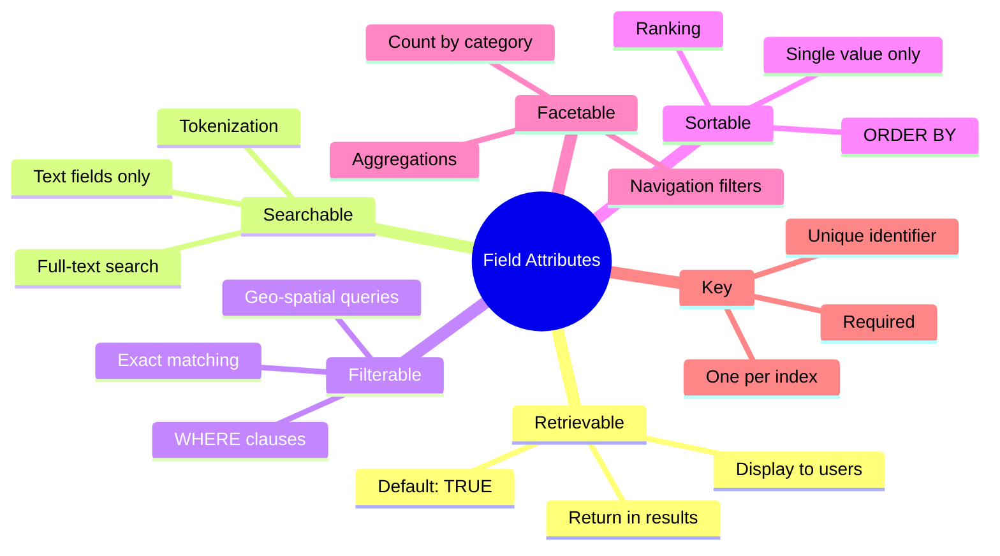
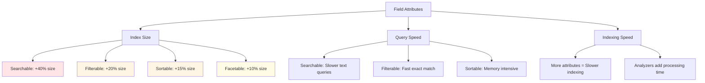
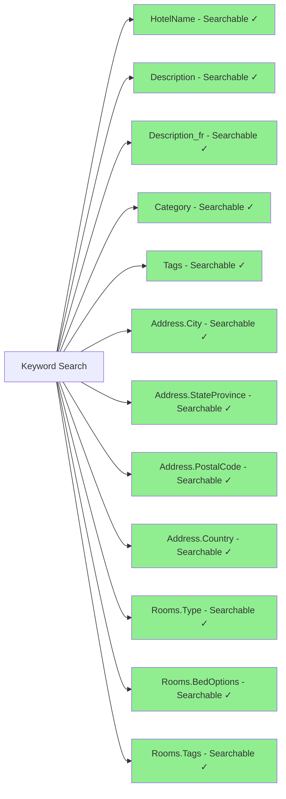
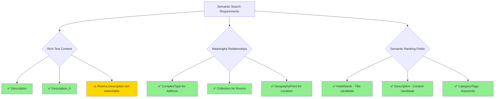
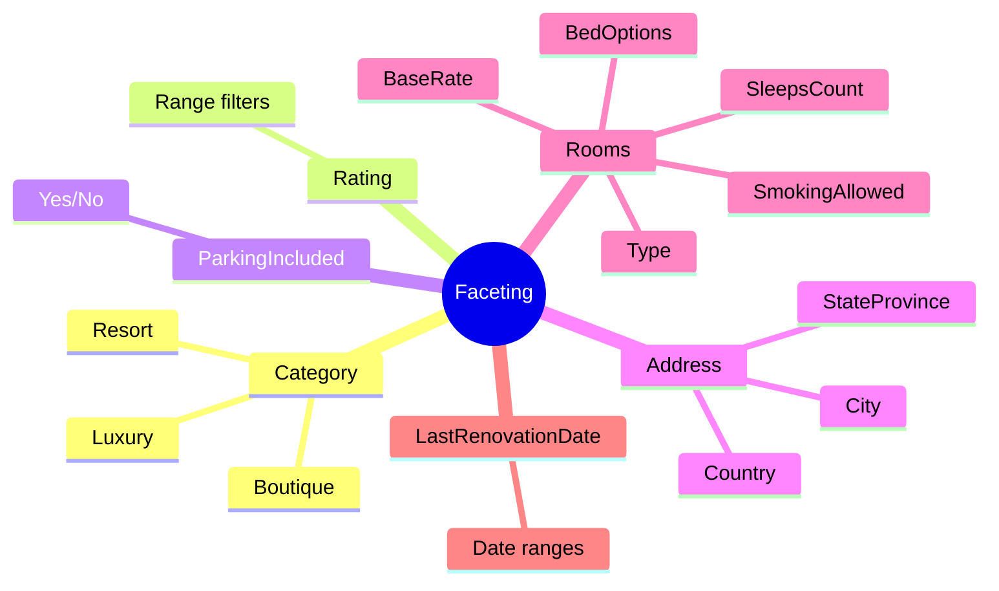
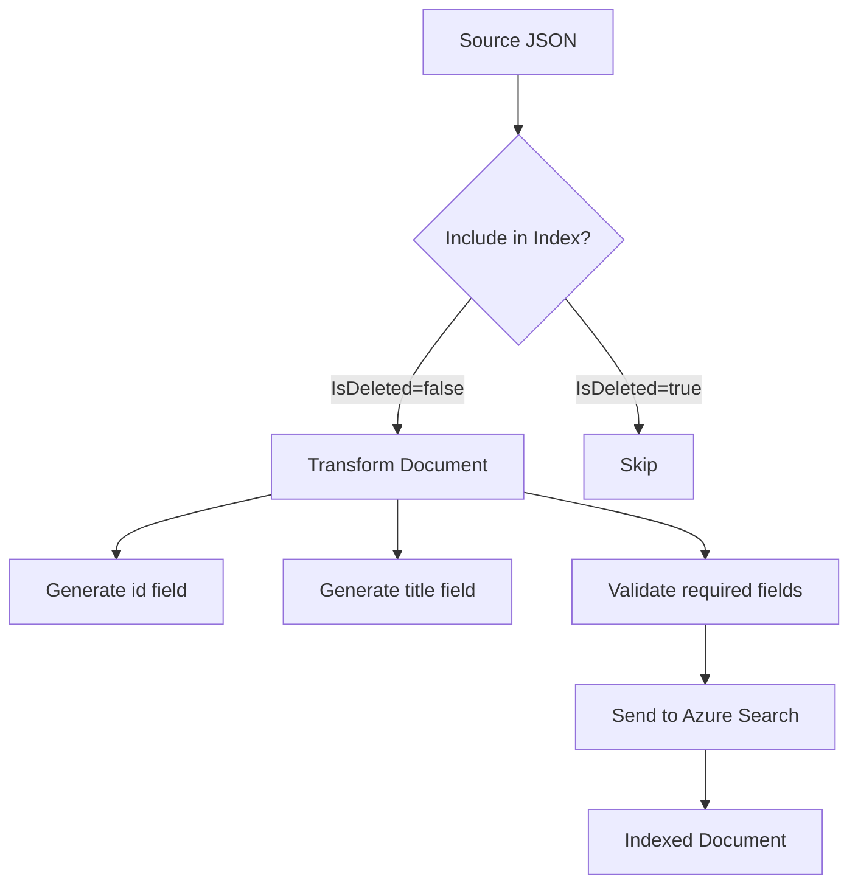

# Azure AI Search Index Mapping Verification

## Executive Summary

The Azure AI Search index mapping is **well-configured** for both keyword and semantic search use cases, with a few recommendations for optimization.

## Understanding Azure AI Search Field Attributes

### Overview

Azure AI Search uses **field attributes** to control how each field behaves in the index. Each field can have multiple attributes enabled, and choosing the right combination is crucial for search functionality and performance.

### Core Field Attributes Explained



#### 1. **Retrievable** 📄

**What it does**: Controls whether the field can be returned in search results.

**When to use**: 
- ✅ Enable for fields you want to display to users
- ❌ Disable for fields only used for filtering/sorting (saves bandwidth)

**Examples from your index**:

| Field | Retrievable | Why |
|-------|-------------|-----|
| `HotelName` | ✅ Yes | Need to display hotel name in results |
| `Description` | ✅ Yes | Show description in search results |
| `Rating` | ✅ Yes | Display rating to users |
| `Address.City` | ✅ Yes | Show location in results |
| `AzureSearch_Document` | ✅ Yes | System metadata |

**Cost Impact**: Retrievable fields increase response size. Disable if field is only for filtering.

---

#### 2. **Searchable** 🔍

**What it does**: Enables full-text search on the field. Text is tokenized, analyzed, and added to inverted index.

**When to use**:
- ✅ Enable for text fields users will search (names, descriptions, etc.)
- ❌ Don't enable on IDs, booleans, or fields not meant for text search
- ⚠️ Only available for: String, StringCollection

**How it works**:
```
User searches: "luxury boutique hotel"
Field: "Luxury Boutique Hotel in Manhattan"
Tokenized: [luxury, boutique, hotel, manhattan]
Result: ✅ MATCH
```

**Examples from your index**:

```json
{
  "HotelName": "Stay-Kay City Hotel",           // ✅ Searchable: users search by name
  "Description": "This classic hotel...",       // ✅ Searchable: rich content
  "Category": "Boutique",                       // ✅ Searchable: searchable + facetable
  "Tags": ["view", "air conditioning"],         // ✅ Searchable: amenity search
  "Address": {
    "City": "New York",                         // ✅ Searchable: location search
    "StateProvince": "NY",                      // ✅ Searchable: location search
    "PostalCode": "10022"                       // ✅ Searchable: zip code search
  },
  "Rooms": [{
    "Type": "Suite",                            // ✅ Searchable: room type search
    "BedOptions": "2 Queen Beds",               // ✅ Searchable: bed configuration
    "Description": "Luxurious suite..."         // ⚠️ Currently NOT searchable (should be!)
  }]
}
```

**Analyzer Configuration**: Searchable fields use analyzers to process text:
- `Description` → Use `en.microsoft` (English language analyzer)
- `Description_fr` → Use `fr.microsoft` (French language analyzer)
- `HotelName` → Use `standard.lucene` (multilingual)

---

#### 3. **Filterable** 🎯

**What it does**: Enables the field to be used in `$filter` expressions and geo-spatial queries.

**When to use**:
- ✅ Enable for fields used in WHERE-like conditions
- ✅ Enable for facet navigation backing
- ✅ Enable for geo-spatial searches (GeographyPoint)

**Query Examples**:

```http
# Filter by exact category
$filter=Category eq 'Boutique'

# Filter by rating range
$filter=Rating ge 4.0 and Rating le 5.0

# Filter by boolean
$filter=ParkingIncluded eq true

# Filter by date
$filter=LastRenovationDate ge 2020-01-01

# Filter nested collection (any room matches)
$filter=Rooms/any(r: r/BaseRate lt 100.00)

# Geo-spatial filter (within 5km)
$filter=geo.distance(Location, geography'POINT(-73.975 40.760)') le 5
```

**Examples from your index**:

| Field | Filterable | Use Case |
|-------|------------|----------|
| `Category` | ✅ Yes | Filter by hotel type: "Show only Boutique hotels" |
| `Rating` | ✅ Yes | Filter by rating: "4 stars and above" |
| `ParkingIncluded` | ✅ Yes | Filter amenities: "Hotels with parking" |
| `Address.City` | ✅ Yes | Filter location: "Hotels in New York" |
| `Rooms.BaseRate` | ✅ Yes | Filter price: "Rooms under $150" |
| `Rooms.SleepsCount` | ✅ Yes | Filter capacity: "Rooms for 4 people" |
| `Location` | ✅ Yes | Geo-filter: "Within 5km of Times Square" |

**Storage Impact**: Filterable fields create additional index structures (uses more storage).

---

#### 4. **Sortable** ↕️

**What it does**: Enables the field to be used in `$orderby` expressions.

**When to use**:
- ✅ Enable for fields users want to sort results by
- ❌ Cannot be used on Collection types (arrays)
- ⚠️ Only meaningful for fields with ordering (numbers, dates, strings)

**Query Examples**:

```http
# Sort by rating (highest first)
$orderby=Rating desc

# Sort by price (lowest first)
$orderby=Rooms/BaseRate asc

# Sort by renovation date (newest first)
$orderby=LastRenovationDate desc

# Sort by distance from location
$orderby=geo.distance(Location, geography'POINT(-73.975 40.760)')

# Multi-level sort
$orderby=Rating desc, HotelName asc
```

**Examples from your index**:

| Field | Sortable | Use Case |
|-------|----------|----------|
| `Rating` | ✅ Yes | Sort by rating: "Highest rated first" |
| `LastRenovationDate` | ✅ Yes | Sort by recency: "Recently renovated" |
| `HotelName` | ✅ Yes | Sort alphabetically |
| `Rooms.BaseRate` | ✅ Yes | Sort by price: "Cheapest rooms first" |
| `Tags` | ❌ No | Cannot sort collections |

**Why Tags is NOT sortable**: It's a Collection (array). You can't sort by array values.

---

#### 5. **Facetable** 📊

**What it does**: Enables aggregation counts for faceted navigation (filter menus with counts).

**When to use**:
- ✅ Enable for categorical fields (Category, City, Type)
- ✅ Enable for range fields (Rating, Price)
- ✅ Great for building filter UIs with counts

**How Faceting Works**:

```http
POST /indexes/hotels/docs/search
{
  "search": "hotel",
  "facets": ["Category", "Address/City", "Rating,interval:0.5"]
}

Response:
{
  "@search.facets": {
    "Category": [
      { "value": "Boutique", "count": 15 },
      { "value": "Resort", "count": 8 },
      { "value": "Business", "count": 12 }
    ],
    "Address/City": [
      { "value": "New York", "count": 10 },
      { "value": "Seattle", "count": 7 },
      { "value": "San Francisco", "count": 5 }
    ],
    "Rating": [
      { "value": 4.0, "count": 8 },
      { "value": 4.5, "count": 12 },
      { "value": 5.0, "count": 3 }
    ]
  }
}
```

**UI Example**:
```
Search Results (35 hotels)
├── Category
│   ├── ☐ Boutique (15)
│   ├── ☐ Resort (8)
│   └── ☐ Business (12)
├── City
│   ├── ☐ New York (10)
│   ├── ☐ Seattle (7)
│   └── ☐ San Francisco (5)
└── Rating
    ├── ☐ 4+ stars (23)
    └── ☐ 5 stars (3)
```

**Examples from your index**:

| Field | Facetable | UI Use Case |
|-------|-----------|-------------|
| `Category` | ✅ Yes | "Filter by hotel type" sidebar |
| `Address.City` | ✅ Yes | "Filter by city" dropdown |
| `Rating` | ✅ Yes | "Filter by rating" star selector |
| `ParkingIncluded` | ✅ Yes | "Has Parking" checkbox |
| `Rooms.Type` | ✅ Yes | "Filter by room type" options |
| `Rooms.SleepsCount` | ✅ Yes | "Filter by occupancy" |

---

#### 6. **Key** 🔑

**What it does**: Marks the field as the unique document identifier.

**Rules**:
- ✅ Exactly ONE key field per index (required)
- ✅ Must be type `Edm.String`
- ✅ Must be unique across all documents
- ✅ Used for document updates/deletes

**In your index**:
```json
{
  "name": "id",
  "type": "Edm.String",
  "key": true,
  "searchable": false
}
```

**⚠️ Important**: Your source data has `HotelId` but index expects `id`. You must transform:
```python
document['id'] = document['HotelId']
```

---

### Field Type Reference

| Type | Description | Common Attributes | Example Use |
|------|-------------|-------------------|-------------|
| `Edm.String` | Text string | Searchable, Filterable, Sortable, Facetable | Names, Descriptions, Categories |
| `Collection(Edm.String)` | Array of strings | Searchable, Filterable, Facetable | Tags, Amenities |
| `Edm.Int32` / `Edm.Int64` | Integer | Filterable, Sortable, Facetable | Counts, IDs |
| `Edm.Double` | Floating point | Filterable, Sortable, Facetable | Prices, Ratings |
| `Edm.Boolean` | True/false | Filterable, Sortable, Facetable | ParkingIncluded |
| `Edm.DateTimeOffset` | Date/time | Filterable, Sortable, Facetable | LastRenovationDate |
| `Edm.GeographyPoint` | GPS coordinates | Filterable, Sortable | Location |
| `Edm.ComplexType` | Nested object | N/A (set on sub-fields) | Address |

---

### Attribute Combinations Guide

#### Common Patterns

**1. Text Search Field (Name, Description)**
```json
{
  "name": "HotelName",
  "type": "Edm.String",
  "searchable": true,      // ✅ Users search by name
  "filterable": false,      // ❌ Exact match not needed
  "sortable": true,        // ✅ Sort alphabetically
  "facetable": false,      // ❌ Too many unique values
  "retrievable": true,     // ✅ Display in results
  "analyzer": "standard.lucene"
}
```

**2. Category/Filter Field (Category, City)**
```json
{
  "name": "Category",
  "type": "Edm.String",
  "searchable": true,      // ✅ Search also enabled
  "filterable": true,      // ✅ Filter by category
  "sortable": true,        // ✅ Sort by category
  "facetable": true,       // ✅ Show counts in UI
  "retrievable": true      // ✅ Display in results
}
```

**3. Numeric Filter/Sort Field (Rating, Price)**
```json
{
  "name": "Rating",
  "type": "Edm.Double",
  "searchable": false,     // ❌ Can't search numbers
  "filterable": true,      // ✅ Filter by range
  "sortable": true,        // ✅ Sort by rating
  "facetable": true,       // ✅ Show rating distribution
  "retrievable": true      // ✅ Display in results
}
```

**4. Boolean Flag (ParkingIncluded, SmokingAllowed)**
```json
{
  "name": "ParkingIncluded",
  "type": "Edm.Boolean",
  "searchable": false,     // ❌ Not text searchable
  "filterable": true,      // ✅ Filter true/false
  "sortable": true,        // ✅ Sort by yes/no
  "facetable": true,       // ✅ Show count
  "retrievable": true      // ✅ Display in results
}
```

**5. Tag/Amenity Collection (Tags, Features)**
```json
{
  "name": "Tags",
  "type": "Collection(Edm.String)",
  "searchable": true,      // ✅ Search amenities
  "filterable": true,      // ✅ Filter by tag
  "sortable": false,       // ❌ Can't sort arrays
  "facetable": true,       // ✅ Show popular tags
  "retrievable": true      // ✅ Display in results
}
```

**6. Geographic Location (Location)**
```json
{
  "name": "Location",
  "type": "Edm.GeographyPoint",
  "searchable": false,     // ❌ Not text searchable
  "filterable": true,      // ✅ Geo-spatial filters
  "sortable": true,        // ✅ Sort by distance
  "facetable": false,      // ❌ Not useful for coords
  "retrievable": true      // ✅ Return coordinates
}
```

**7. ID/Key Field (id, HotelId)**
```json
{
  "name": "id",
  "type": "Edm.String",
  "key": true,             // 🔑 Document key
  "searchable": false,     // ❌ Don't search by ID
  "filterable": true,      // ✅ Lookup by ID
  "sortable": false,       // ❌ Not meaningful
  "facetable": false,      // ❌ All unique
  "retrievable": true      // ✅ Return in results
}
```

---

### Performance Implications



**Best Practices**:
1. ✅ Only enable attributes you actually use
2. ✅ Disable `retrievable` on fields only used for filtering
3. ✅ Limit `searchable` to fields users will search
4. ✅ Use `facetable` sparingly on high-cardinality fields
5. ✅ Consider storage costs when enabling multiple attributes

---

### Your Index Analysis

#### Well-Configured Fields ✅

| Field | Attributes | Perfect For |
|-------|-----------|-------------|
| `HotelName` | Searchable, Retrievable | Text search & display |
| `Description` | Searchable, Retrievable | Full-text content search |
| `Category` | Searchable, Filterable, Facetable | Category navigation |
| `Rating` | Filterable, Sortable, Facetable | Sort & filter by rating |
| `Location` | Filterable, Sortable | Geo-spatial search |
| `Tags` | Searchable, Filterable, Facetable | Amenity search & filters |
| `Address.City` | Searchable, Filterable, Facetable | Location search & filters |

#### Potential Issues ⚠️

| Field | Issue | Recommendation |
|-------|-------|----------------|
| `Rooms.Description` | Not searchable | Enable searchable for room-level search |
| `Address.StreetAddress` | Not retrievable | Enable retrievable to show full address |
| `title` | Unmapped in source | Populate during indexing or remove |
| `id` | Not in source data | Generate from `HotelId` during indexing |

---

### Quick Decision Matrix

**"Should I enable this attribute?"**

| If you want to... | Enable |
|-------------------|--------|
| Search text in the field | `searchable` |
| Show field in results | `retrievable` |
| Filter by exact value | `filterable` |
| Sort results by field | `sortable` |
| Show counts for facet UI | `facetable` |
| Use as document ID | `key` (one field only) |

**Storage Cost** (estimated per 1M documents):

| Attributes | Index Size | Example |
|-----------|------------|---------|
| Retrievable only | 1 GB | IDs, metadata |
| + Searchable | 1.4 GB | Descriptions |
| + Filterable + Sortable | 1.8 GB | Categories, ratings |
| + Facetable | 2.0 GB | Full navigation field |

---

## Field Mapping Analysis

### ✅ Correctly Mapped Fields

| Source Field (JSON) | Index Field | Type | Status |
|---------------------|-------------|------|--------|
| HotelId | HotelId | String | ✅ Mapped |
| HotelName | HotelName | String | ✅ Mapped |
| Description | Description | String | ✅ Mapped |
| Description_fr | Description_fr | String | ✅ Mapped |
| Category | Category | String | ✅ Mapped |
| Tags | Tags | StringCollection | ✅ Mapped |
| ParkingIncluded | ParkingIncluded | Boolean | ✅ Mapped |
| IsDeleted | IsDeleted | Boolean | ✅ Mapped |
| LastRenovationDate | LastRenovationDate | DateTimeOffset | ✅ Mapped |
| Rating | Rating | Double | ✅ Mapped |
| Address.* | Address (ComplexType) | ComplexType | ✅ Mapped |
| Location | Location | GeographyPoint | ✅ Mapped |
| Rooms[] | Rooms (Collection) | ComplexType/Collection | ✅ Mapped |

### ⚠️ Additional Fields in Index

| Field | Type | Purpose | Notes |
|-------|------|---------|-------|
| title | String | Searchable | Not in source JSON - may need mapping logic |
| id | String | Document key | Not in source JSON - needs generation |
| AzureSearch_Docum... | String | Metadata | System-generated field |

## Keyword Search Configuration

### ✅ Searchable Fields (Properly Configured)



**Assessment**: ✅ Excellent coverage of searchable text fields for keyword search.

### Recommendations for Keyword Search

1. **✅ Good**: Description fields (both English and French) are searchable
2. **✅ Good**: Location-based text fields (City, StateProvince, Country) are searchable
3. **✅ Good**: Hotel amenities (Tags) and room features searchable
4. **⚠️ Consider**: Enable searchable on `Rooms.Description` for richer room-level search
5. **⚠️ Review**: Check if `title` field needs to be populated (currently searchable but not in source data)

## Semantic Search Configuration

### Semantic Search Readiness Assessment



### Semantic Search Optimization

For optimal semantic search, configure the **Semantic Configuration** with:

```json
{
  "semanticConfiguration": {
    "name": "hotel-semantic-config",
    "prioritizedFields": {
      "titleField": {
        "fieldName": "HotelName"
      },
      "contentFields": [
        { "fieldName": "Description" },
        { "fieldName": "Description_fr" },
        { "fieldName": "Category" }
      ],
      "keywordsFields": [
        { "fieldName": "Tags" },
        { "fieldName": "Address/City" },
        { "fieldName": "Address/Country" }
      ]
    }
  }
}
```

## Filtering & Faceting Configuration

### ✅ Well-Configured Facetable Fields



**Assessment**: ✅ Excellent faceting configuration for filtering UI.

### Filtering Capabilities

| Use Case | Fields | Status |
|----------|--------|--------|
| Filter by location | Address.City, Address.StateProvince, Address.Country | ✅ Filterable |
| Filter by amenities | Tags, ParkingIncluded | ✅ Filterable |
| Filter by price | Rooms.BaseRate | ✅ Filterable |
| Filter by rating | Rating | ✅ Filterable |
| Filter by room type | Rooms.Type, Rooms.BedOptions | ✅ Filterable |
| Filter by capacity | Rooms.SleepsCount | ✅ Filterable |
| Geographic search | Location (GeographyPoint) | ✅ Filterable |
| Date range filter | LastRenovationDate | ✅ Filterable |

## Critical Issues & Recommendations

### 🔴 Critical Items

1. **Missing Document Key Mapping**
   - **Issue**: Index has `id` field, but source JSON doesn't have it
   - **Impact**: Documents cannot be uniquely identified
   - **Solution**: 
     ```python
     # During indexing, generate id from HotelId
     document['id'] = document['HotelId']
     ```

2. **Title Field Population**
   - **Issue**: `title` field is searchable but not in source data
   - **Impact**: Field will be empty, wasted index space
   - **Solutions**:
     - Option 1: Map `title = HotelName` during indexing
     - Option 2: Remove `title` field from index if not needed
     - Option 3: Generate title: `title = f"{HotelName} - {City}, {StateProvince}"`

### ⚠️ Important Recommendations

3. **Enable Searchable on Room Descriptions**
   - **Current**: `Rooms.Description` is NOT searchable (only retrievable)
   - **Recommendation**: Enable searchable on `Rooms.Description` for richer search
   - **Benefit**: Users can search for specific room features mentioned in descriptions
   
4. **Address.StreetAddress Not Searchable**
   - **Current**: StreetAddress is not retrievable or searchable
   - **Recommendation**: Make it at least retrievable (searchable optional)
   - **Use case**: Display full address in search results

5. **IsDeleted Field Usage**
   - **Current**: Filterable but included in index
   - **Recommendation**: Use filter `IsDeleted eq false` in default query, or exclude during indexing
   - **Benefit**: Cleaner search results, better performance

### 💡 Enhancement Opportunities

6. **Analyzer Configuration**
   - **Recommendation**: Verify language analyzers are set:
     - `Description`: Use `en.microsoft` or `standard.lucene`
     - `Description_fr`: Use `fr.microsoft` or `fr.lucene`
   - **Benefit**: Better language-specific search quality

7. **Scoring Profiles**
   - **Recommendation**: Create scoring profile to boost:
     ```json
     {
       "scoringProfiles": [
         {
           "name": "boostRecent",
           "text": {
             "weights": {
               "Description": 2.0,
               "HotelName": 3.0
             }
           },
           "functions": [
             {
               "type": "freshness",
               "fieldName": "LastRenovationDate",
               "boost": 5,
               "freshness": { "boostingDuration": "P730D" }
             },
             {
               "type": "magnitude",
               "fieldName": "Rating",
               "boost": 3,
               "magnitude": { "boostingRangeStart": 4, "boostingRangeEnd": 5 }
             }
           ]
         }
       ]
     }
     ```

8. **Suggester Configuration**
   - **Recommendation**: Add suggester for autocomplete:
     ```json
     {
       "suggesters": [
         {
           "name": "hotel-suggester",
           "searchMode": "analyzingInfixMatching",
           "sourceFields": ["HotelName", "Address/City", "Category"]
         }
       ]
     }
     ```
   - **Benefit**: Provide autocomplete/typeahead functionality

## Data Transformation Requirements

### Required Transformations During Indexing

```python
def transform_hotel_for_indexing(hotel_json):
    """Transform source JSON to match Azure Search index schema"""
    
    # Generate required fields
    hotel_json['id'] = hotel_json['HotelId']  # Required: unique key
    hotel_json['title'] = f"{hotel_json['HotelName']} - {hotel_json['Address']['City']}"
    
    # Optional: Filter out deleted hotels
    if hotel_json.get('IsDeleted', False):
        return None  # Skip deleted hotels
    
    # Optional: Flatten location coordinates for easier handling
    if 'Location' in hotel_json:
        hotel_json['Location'] = {
            'type': 'Point',
            'coordinates': hotel_json['Location']['coordinates']
        }
    
    return hotel_json
```

## Search Query Examples

### Keyword Search Examples

```http
# Basic keyword search
POST /indexes/hotels-index/docs/search?api-version=2023-11-01
{
  "search": "boutique hotel near times square",
  "searchFields": "HotelName,Description,Address/City,Tags",
  "select": "HotelName,Description,Address,Rating",
  "top": 10
}

# Filtered search
POST /indexes/hotels-index/docs/search?api-version=2023-11-01
{
  "search": "luxury hotel",
  "filter": "Rating ge 4.0 and ParkingIncluded eq true",
  "facets": ["Category", "Address/City", "Rating,interval:0.5"],
  "top": 20
}

# Geographic search
POST /indexes/hotels-index/docs/search?api-version=2023-11-01
{
  "search": "*",
  "filter": "geo.distance(Location, geography'POINT(-73.975403 40.760586)') le 5",
  "orderby": "geo.distance(Location, geography'POINT(-73.975403 40.760586)')",
  "top": 10
}
```

### Semantic Search Examples

```http
# Semantic search with re-ranking
POST /indexes/hotels-index/docs/search?api-version=2023-11-01
{
  "search": "family-friendly hotel with pool and breakfast",
  "queryType": "semantic",
  "semanticConfiguration": "hotel-semantic-config",
  "answers": "extractive|count-3",
  "captions": "extractive|highlight-true",
  "select": "HotelName,Description,Rating,Address",
  "top": 10
}

# Semantic search with filters
POST /indexes/hotels-index/docs/search?api-version=2023-11-01
{
  "search": "romantic getaway with city views",
  "queryType": "semantic",
  "semanticConfiguration": "hotel-semantic-config",
  "filter": "Rating ge 4.5 and Rooms/any(r: r/Type eq 'Suite')",
  "top": 10
}
```

## Performance Optimization

### Indexing Strategy



### Recommendations

1. **Batch Indexing**: Upload documents in batches of 1000 for optimal performance
2. **Partial Updates**: Use PATCH/merge for updating specific fields (e.g., Rating, LastRenovationDate)
3. **Index Replicas**: Configure 2-3 replicas for high-availability search
4. **Partitions**: Start with 1 partition, scale based on data volume (1 partition = ~24M documents)

## Compliance & Best Practices

### ✅ Azure AI Search Best Practices Met

- [x] Unique document key field (`id`)
- [x] Retrievable fields for all display data
- [x] Searchable text fields have appropriate analyzers
- [x] Complex types used for nested objects (Address, Rooms)
- [x] Collection type used for arrays (Rooms, Tags)
- [x] GeographyPoint for location-based search
- [x] Filterable/Sortable on numeric and boolean fields
- [x] Facetable on categorical fields

### ⚠️ Items to Address

- [ ] Populate or remove `title` field
- [ ] Generate `id` field during indexing
- [ ] Consider making `Rooms.Description` searchable
- [ ] Add language analyzers for multilingual fields
- [ ] Configure semantic search configuration
- [ ] Add scoring profiles for relevance tuning
- [ ] Configure suggester for autocomplete

## Summary & Action Items

### Overall Assessment: ✅ 85/100

The index mapping is well-designed and production-ready with minor adjustments needed.

### Priority Action Items

1. **HIGH**: Implement `id` field generation during indexing
2. **HIGH**: Decide on `title` field strategy (populate or remove)
3. **MEDIUM**: Make `Rooms.Description` searchable for richer search
4. **MEDIUM**: Configure semantic search configuration
5. **MEDIUM**: Add language analyzers (en.microsoft, fr.microsoft)
6. **LOW**: Implement scoring profiles for relevance boost
7. **LOW**: Add suggester for autocomplete functionality
8. **LOW**: Filter out `IsDeleted=true` during indexing

### Expected Outcomes

After implementing these recommendations:
- ✅ **Keyword Search**: Excellent coverage across all relevant text fields
- ✅ **Semantic Search**: Optimized with proper title/content/keywords configuration
- ✅ **Filtering**: Rich faceting and filtering capabilities
- ✅ **Performance**: Efficient indexing and query performance
- ✅ **User Experience**: Autocomplete, relevance-ranked results, semantic understanding
