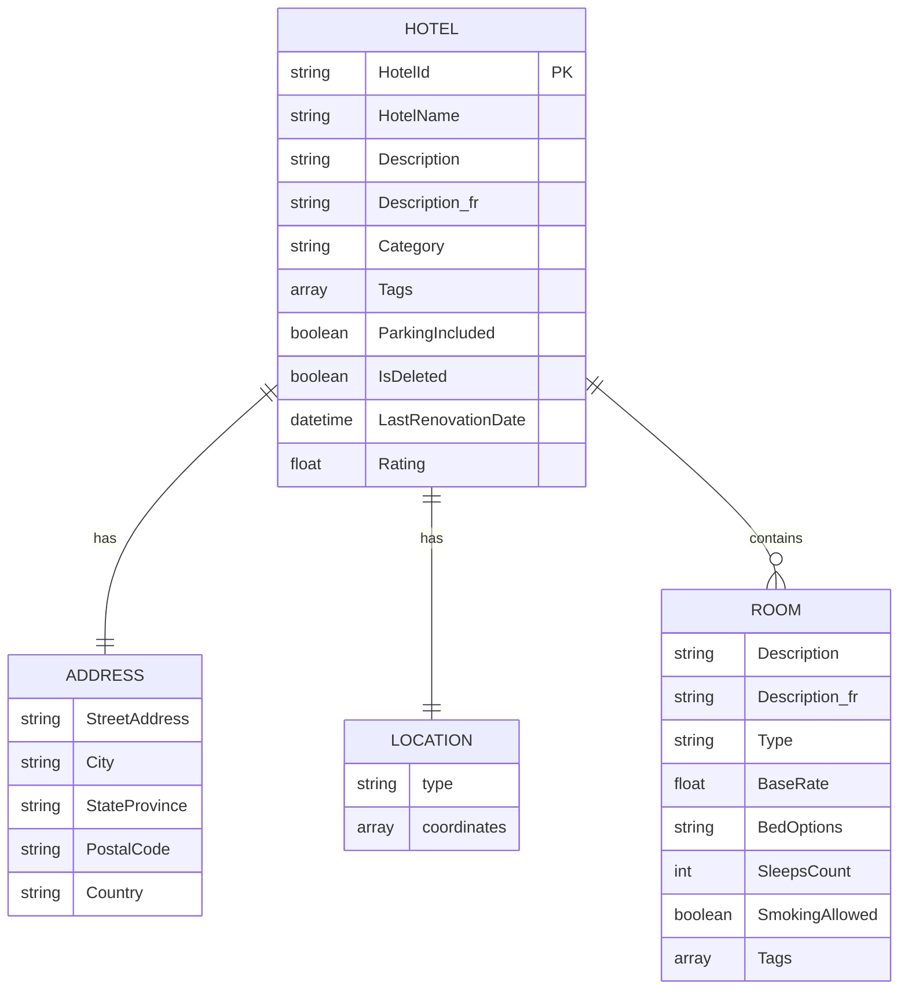
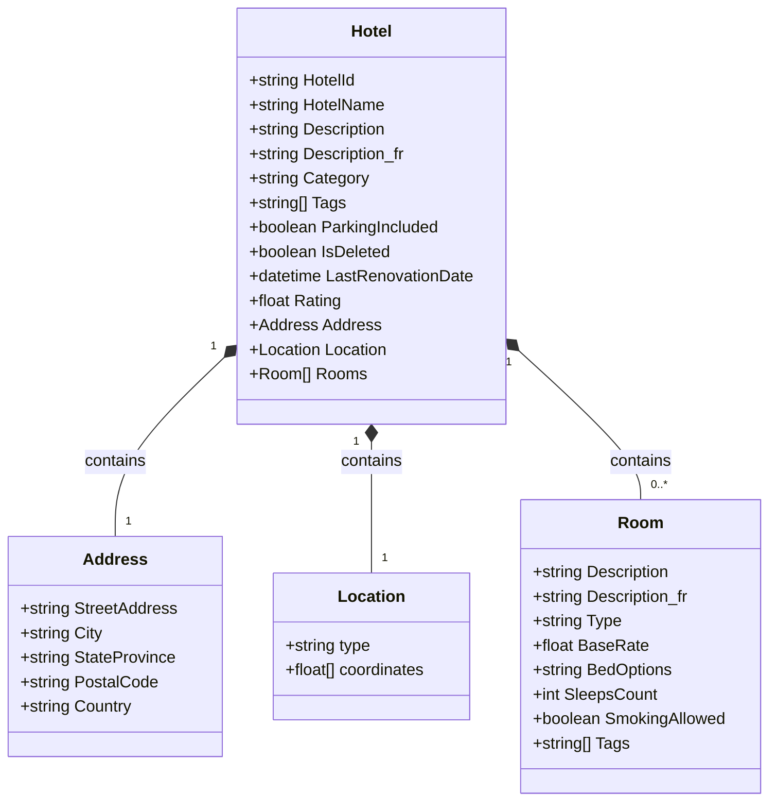
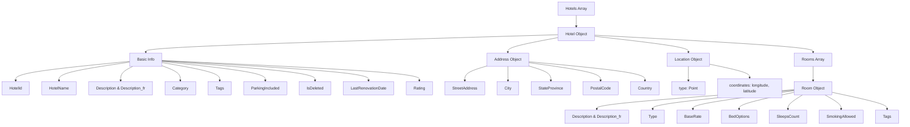

# Hotels Data Structure

This document describes the structure of the `HotelsData_toAzureBlobs.json` file.

## Overview

The JSON file contains an array of hotel objects, each with detailed information about the hotel, its location, and available rooms.

## Data Structure

### Entity Relationship



### Class Diagram



### Structure Flow



## Field Descriptions

### Hotel Object

| Field | Type | Description |
|-------|------|-------------|
| `HotelId` | string | Unique identifier for the hotel |
| `HotelName` | string | Name of the hotel |
| `Description` | string | Hotel description in English |
| `Description_fr` | string | Hotel description in French |
| `Category` | string | Hotel category (e.g., "Boutique") |
| `Tags` | array of strings | Amenities and features (e.g., "view", "air conditioning", "concierge") |
| `ParkingIncluded` | boolean | Whether parking is included |
| `IsDeleted` | boolean | Soft delete flag |
| `LastRenovationDate` | datetime | ISO 8601 format timestamp of last renovation |
| `Rating` | float | Hotel rating (e.g., 3.60) |
| `Address` | object | Physical address of the hotel |
| `Location` | object | Geographic coordinates (GeoJSON format) |
| `Rooms` | array of objects | Available room types |

### Address Object

| Field | Type | Description |
|-------|------|-------------|
| `StreetAddress` | string | Street address |
| `City` | string | City name |
| `StateProvince` | string | State or province code |
| `PostalCode` | string | ZIP/postal code |
| `Country` | string | Country name |

### Location Object

| Field | Type | Description |
|-------|------|-------------|
| `type` | string | GeoJSON type (always "Point") |
| `coordinates` | array of floats | [longitude, latitude] in decimal degrees |

### Room Object

| Field | Type | Description |
|-------|------|-------------|
| `Description` | string | Room description in English |
| `Description_fr` | string | Room description in French |
| `Type` | string | Room type (e.g., "Budget Room", "Suite", "Deluxe Room") |
| `BaseRate` | float | Nightly rate in USD |
| `BedOptions` | string | Bed configuration (e.g., "1 Queen Bed", "2 Double Beds") |
| `SleepsCount` | integer | Maximum occupancy |
| `SmokingAllowed` | boolean | Whether smoking is permitted |
| `Tags` | array of strings | Room-specific amenities (e.g., "vcr/dvd", "jacuzzi tub") |

## Example Data

```json
{
  "HotelId": "1",
  "HotelName": "Stay-Kay City Hotel",
  "Description": "This classic hotel is fully-refurbished...",
  "Description_fr": "Cet hôtel classique entièrement rénové...",
  "Category": "Boutique",
  "Tags": ["view", "air conditioning", "concierge"],
  "ParkingIncluded": false,
  "IsDeleted": false,
  "LastRenovationDate": "2022-01-18T00:00:00Z",
  "Rating": 3.60,
  "Address": {
    "StreetAddress": "677 5th Ave",
    "City": "New York",
    "StateProvince": "NY",
    "PostalCode": "10022",
    "Country": "USA"
  },
  "Location": {
    "type": "Point",
    "coordinates": [-73.975403, 40.760586]
  },
  "Rooms": [
    {
      "Description": "Budget Room, 1 Queen Bed (Cityside)",
      "Description_fr": "Chambre Économique, 1 grand lit (côté ville)",
      "Type": "Budget Room",
      "BaseRate": 96.99,
      "BedOptions": "1 Queen Bed",
      "SleepsCount": 2,
      "SmokingAllowed": true,
      "Tags": ["vcr/dvd"]
    }
  ]
}
```

## Notes

- The file format is standard JSON array containing hotel objects
- All descriptions are provided in both English and French
- Location coordinates follow the GeoJSON specification (longitude first, then latitude)
- Each hotel can have multiple room types with varying rates and amenities
- The data structure is suitable for Azure Blob Storage and Azure Cognitive Search indexing
