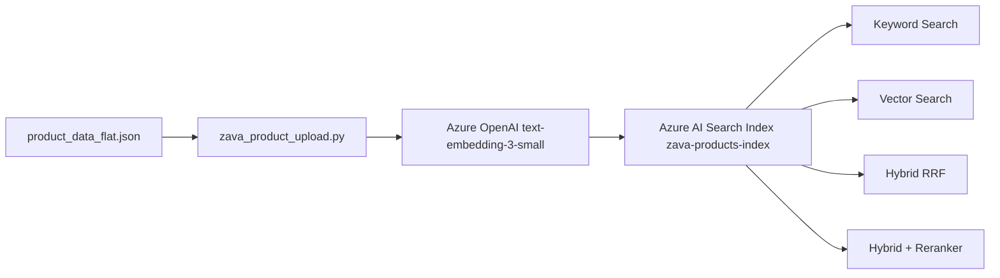

# Zava Product Data

## File

`product_data_flat.json` — flat JSON array of 419 hardware/home-improvement products used to populate the Azure AI Search demo index.

## Schema

Each product is a JSON object with the following fields:

| Field | Type | Description |
|---|---|---|
| `sku` | string | Unique product identifier (primary key in the search index) |
| `name` | string | Short product name |
| `description` | string | Full product description (used for full-text and semantic search) |
| `price` | number | Price in USD (range: $2 – $475) |
| `stock_level` | integer | Units currently in stock |
| `categories` | string[] | Hierarchical category path, e.g. `["HAND TOOLS", "HAMMERS"]` |

### Example record

```json
{
  "sku": "HTHM001600",
  "name": "Professional Claw Hammer 16oz",
  "description": "High-quality steel claw hammer with comfortable fiberglass handle, perfect for framing and general construction work.",
  "price": 28,
  "stock_level": 25,
  "categories": ["HAND TOOLS", "HAMMERS"]
}
```

## Category breakdown

| Top-level category | Products |
|---|---|
| ELECTRICAL | 48 |
| GARDEN & OUTDOOR | 43 |
| HAND TOOLS | 31 |
| HARDWARE | 50 |
| LUMBER & BUILDING MATERIALS | 50 |
| PAINT & FINISHES | 51 |
| PLUMBING | 48 |
| POWER TOOLS | 49 |
| STORAGE & ORGANIZATION | 49 |
| **Total** | **419** |

## How the data is used



1. `zava_product_upload.py` reads this file and creates an embedding for each product by concatenating `name`, `description`, and `categories`.
2. Embeddings are generated via `text-embedding-3-small` (1536 dimensions).
3. Products plus their embeddings are uploaded to the `zava-products-index` Azure AI Search index.
4. The index is then queried by the four search demo scripts/notebooks.

## Regenerating / updating data

To re-upload after modifying this file:

```shell
python zava_product_upload.py
```

This will delete the existing index, recreate it with the correct schema, regenerate all embeddings, and re-upload all products.
