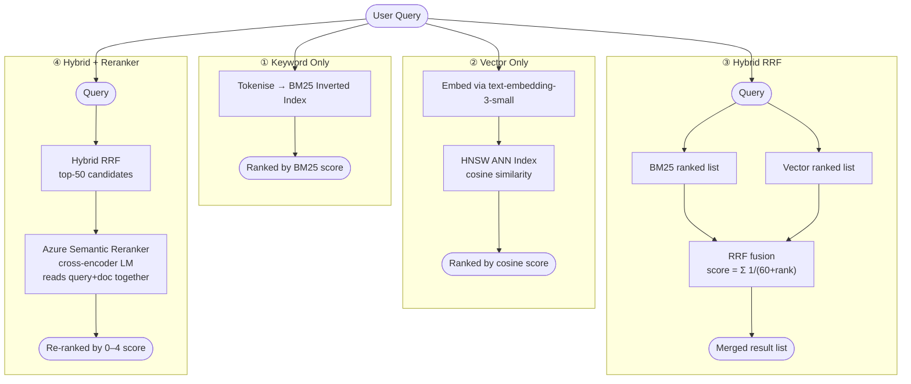
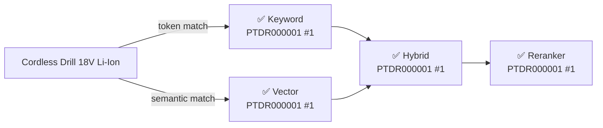
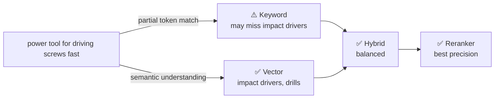
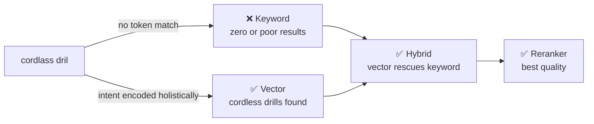
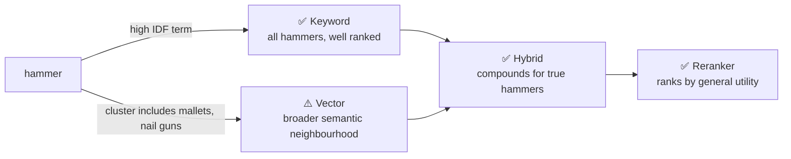
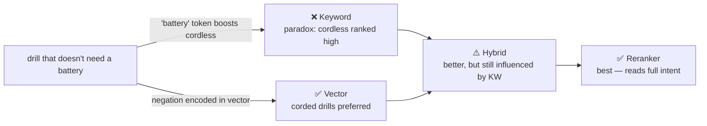
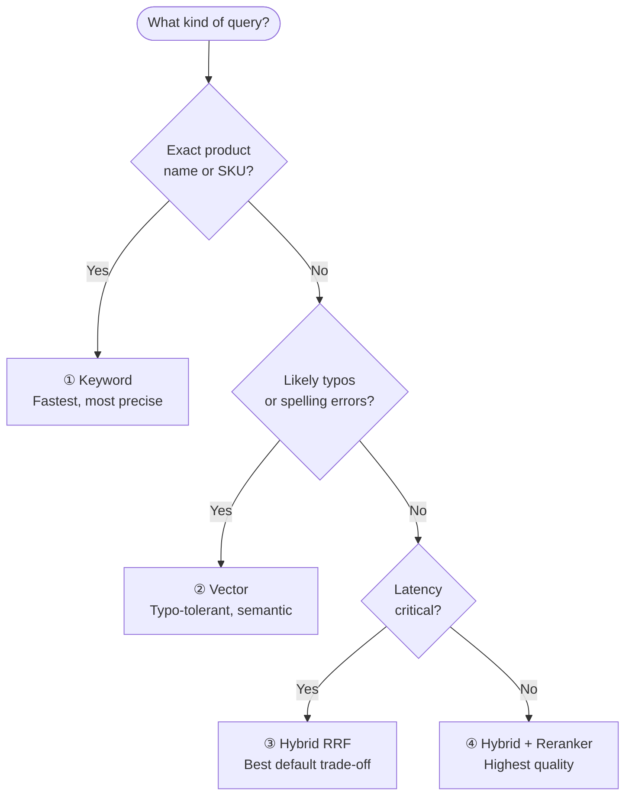

# Search Mode Comparison Guide

This document explains the design of each query scenario in `zava_search_comparison.py` and what the results reveal about each Azure AI Search mode.

---

## The Four Search Modes at a Glance



---

## How Scoring Works Per Mode

| Mode | Score field | Range | Interpretation |
|---|---|---|---|
| Keyword | `@search.score` | 0 → ∞ | Higher = more BM25 term overlap |
| Vector | `@search.score` | 0 → 1 | Closer to 1 = more cosine similarity |
| Hybrid | `@search.score` | 0 → ~0.07 | RRF compound score (lower values are normal) |
| Reranker | `@search.reranker_score` | 0 → 4 | Cross-encoder relevance; >1.5 = strong match |

> **Note**: RRF scores look small (e.g. `0.0333`) because the formula `1/(60+rank)` is bounded. A document ranked #1 in both lists scores `1/61 + 1/61 ≈ 0.0328`. This is intentional — the value is relative, not absolute.

---

## Scenario Design

Each scenario is crafted to isolate a specific search behaviour.

### Scenario 1 — Exact Product Name
**Query**: `"Cordless Drill 18V Li-Ion"`



**What it shows**: All modes converge on the correct answer. This is the *easy case* — use it as a sanity check that the index is working.

---

### Scenario 2 — Synonym / Natural Language
**Query**: `"power tool for driving screws fast"`



**What it shows**: No product says "power tool for driving screws fast" verbatim. The embedding model understands that this intent maps to *impact drivers* and *drills* — keyword alone can't make that leap.

---

### Scenario 3 — Misspelling
**Query**: `"cordlass dril"` (typos: cordless → cordlass, drill → dril)



**What it shows**: Azure AI Search BM25 does *not* do fuzzy matching by default. The embedding model encodes meaning from the whole phrase, not character sequences, making vector search naturally typo-tolerant.

---

### Scenario 4 — Conceptual / Safety-Aware Query
**Query**: `"something to safely cut through drywall without damaging electrical wires"`

This is the most complex query. It combines:
- **Task**: cut drywall
- **Constraint**: without damaging wires
- **Implication**: oscillating multi-tool / drywall saw preferred over circular saw

| Mode | Expected behaviour |
|---|---|
| Keyword | Finds products with "drywall" or "electrical" in text; ranking unreliable |
| Vector | Surfaces oscillating tools and drywall saws based on conceptual similarity |
| Hybrid | Balanced; keyword anchors on "drywall", vector adds safer cutting tools |
| Reranker | Best — cross-encoder understands the safety constraint in full context |

---

### Scenario 5 — Short Ambiguous Query
**Query**: `"hammer"`



**What it shows**: A single common noun. Keyword is precise (exact token match). Vector is *too* broad — the semantic neighbourhood of "hammer" includes mallets, sledges, and potentially nail guns. Hybrid RRF boosts products appearing in both lists (real hammers).

---

### Scenario 6 — OData Filter + Text Search
**Query**: `"sander"` + `filter: price le 60 and categories/any(c: c eq 'POWER TOOLS')`

**What it shows**: Structured filtering is orthogonal to search mode. The OData filter is evaluated *before* BM25/vector scoring — only matching documents enter the scorer. This works identically for all four modes.

```python
# Filter syntax reference
price le 60                                      # less-than-or-equal
price ge 50 and price le 100                     # range
categories/any(c: c eq 'POWER TOOLS')            # collection contains value
stock_level gt 0                                 # in-stock only
```

---

### Scenario 7 — Cross-Category Concept
**Query**: `"measuring and marking for woodworking"`

**What it shows**: Vector search can span multiple index categories in a single query because the embedding captures the *use-case context*, not just matching category names. Keyword is limited to products that literally mention "measuring" or "marking" in their description.

---

### Scenario 8 — Technical Specification
**Query**: `"1/2 inch drive torque wrench"`

**What it shows**: The *opposite* of scenario 2. Precise technical vocabulary directly matches indexed product names. BM25 excels here — it rewards exact token overlap and the target product (`HTWR000005`) contains every token. Vector also finds it, but the advantage goes to keyword for high-precision tech specs.

---

### Scenario 9 — Negation
**Query**: `"drill that doesn't need a battery"`



**What it shows**: BM25's fatal flaw with negation — it scores for term *presence*, not for term *absence*. "battery" appears frequently in cordless drill descriptions, so BM25 perversely ranks them *higher*. The embedding model and reranker handle negation far better.

---

### Scenario 10 — Use-Case Query
**Query**: `"tools I need to hang shelves on a concrete wall"`

**What it shows**: The full end-to-end advantage of the pipeline. A user describes a task, not a product. The ideal result set includes:
- A hammer drill (to drill into concrete)
- Masonry anchors / wall plugs
- A level (to hang shelves straight)
- Potentially a screwdriver or driver bit set

Only vector + reranker can map a task description to a multi-product tool set.

---

## Decision Guide



| Use case | Recommended mode |
|---|---|
| Internal warehouse lookup by SKU | Keyword (with filter) |
| E-commerce search bar | Hybrid RRF (default) |
| Conversational / voice shopping | Vector or Hybrid |
| "Did you mean?" / typo recovery | Vector |
| High-value / low-volume queries | Hybrid + Reranker |
| Category browse with price range | Keyword or Hybrid + OData filter |

---

## Running the Comparison Script

```bash
# Run all 10 scenarios (all 4 modes each)
python zava_search_comparison.py

# Run one scenario
python zava_search_comparison.py --scenario 9

# Run two specific modes only
python zava_search_comparison.py --scenario 3 --modes keyword vector

# Available flags
#   --scenario / -s   1-10
#   --modes / -m      keyword  vector  hybrid  reranker
```

