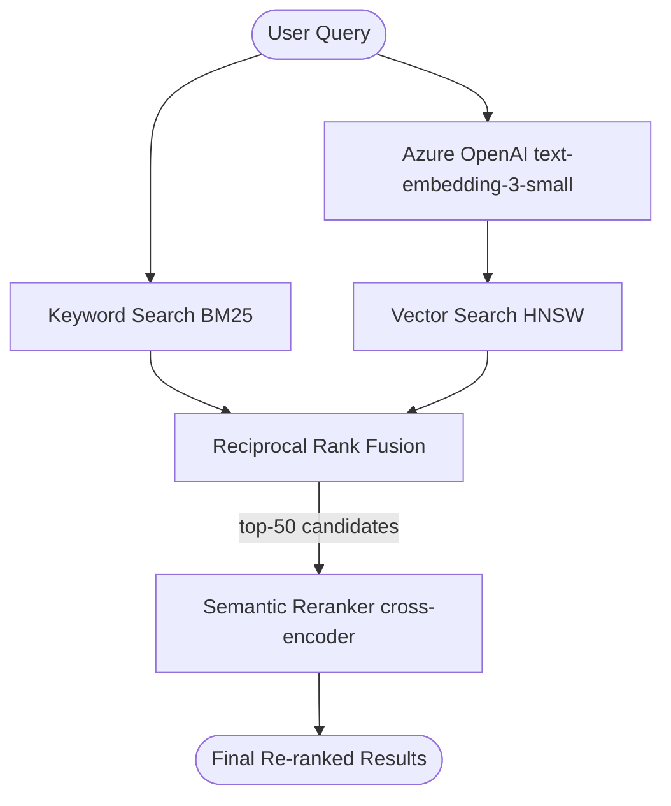

# Hybrid Search with RRF + Semantic Reranker

This is the most powerful search mode: hybrid RRF retrieves a broad candidate set, then Azure AI Search's **semantic reranker** (powered by a cross-encoder language model) re-scores and reorders the top results for maximum relevance.

## How it works



### Two-stage pipeline

| Stage | Method | Purpose |
|---|---|---|
| **1 — Retrieval** | BM25 + HNSW via RRF | Cast a wide net; recall-focused |
| **2 — Reranking** | Azure semantic reranker (cross-encoder) | Deep relevance scoring; precision-focused |

The reranker reads the full query and each candidate document together (not just their individual scores), enabling it to judge **contextual relevance** far more accurately than a first-stage ranker.

## Semantic configuration

The index is configured with a semantic configuration named `products-semantic-config`:

| Priority | Field |
|---|---|
| Title | `name` |
| Content | `description` |
| Keywords | `categories` |

## Reranker score

Each result includes a `@search.reranker_score` (0–4). Scores above **1.5** are generally considered strong matches.

| Score range | Band | Interpretation |
|---|---|---|
| 0 – 1 | Weak | Likely not relevant |
| 1 – 2 | Moderate | Possibly relevant |
| 2 – 3 | Good | Relevant |
| 3 – 4 | Excellent | Highly relevant |

## Strengths

- Highest relevance quality of all four search modes.
- Understands nuanced query intent (e.g., *"durable outdoor hose for high pressure"*).
- Reranker score provides a reliable relevance signal for threshold filtering.

## Limitations

- Adds ~100–200 ms latency for the reranking pass.
- Requires the **Standard** (S1+) Azure AI Search tier.
- Reranking is applied to at most 50 candidates from stage 1.

## Code

**Script:** `zava_search_reranker.py`  
**Notebook:** `zava_search_reranker.ipynb`

```python
results = search_client.search(
    search_query,
    top=5,
    vector_queries=[VectorizedQuery(
        vector=search_vector,
        k_nearest_neighbors=50,
        fields="embedding"
    )],
    query_type="semantic",
    semantic_configuration_name="products-semantic-config",
)
```

## When to use

Use hybrid + reranker when result quality matters most — e.g., the primary search bar of a consumer-facing product catalog. The latency trade-off is usually worth it for the relevance improvement over plain hybrid RRF.

## Search mode comparison

| Mode | Latency | Relevance |
|---|---|---|
| Keyword | ⚡ Lowest | ⭐⭐ |
| Vector | ⚡⚡ Low | ⭐⭐⭐ |
| Hybrid RRF | ⚡⚡⚡ Medium | ⭐⭐⭐⭐ |
| Hybrid + Reranker | ⚡⚡⚡⚡ Higher | ⭐⭐⭐⭐⭐ |
