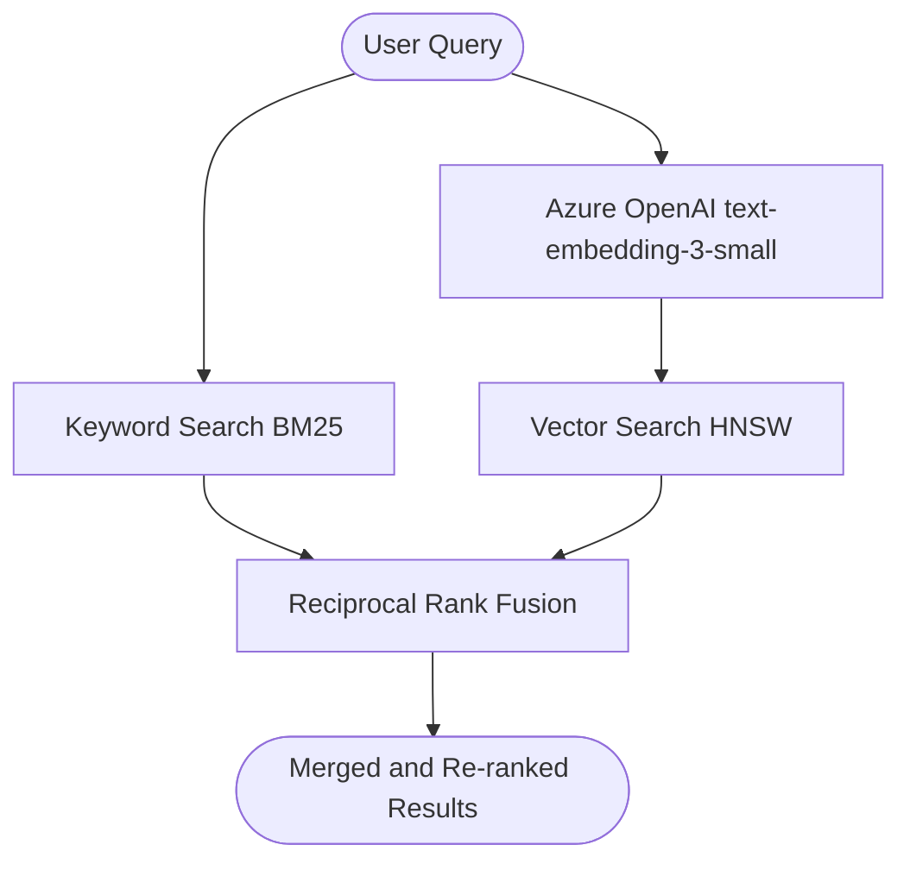

# Hybrid Search with RRF (Reciprocal Rank Fusion)

Hybrid search runs **both** a keyword search and a vector search in parallel and merges their ranked result lists using **Reciprocal Rank Fusion (RRF)**. This combines the strengths of both approaches without needing to tune score weights.

## How it works



### RRF scoring formula

For each document $d$ appearing in result lists $L_1, L_2, \ldots$:

$$\text{RRF}(d) = \sum_{i} \frac{1}{k + \text{rank}_i(d)}$$

where $k = 60$ (constant that dampens the influence of high-ranked documents). Documents appearing in both lists get a compounded boost.

## Strengths

- Best of both worlds: exact keyword precision **+** semantic recall.
- Fusion is **score-agnostic** — no need to normalise BM25 and cosine scores onto the same scale.
- Consistently outperforms either method alone on mixed query types.

## Limitations

- Requires an OpenAI embedding call per query.
- Slightly higher latency than keyword-only search.

## Code

**Script:** `zava_search_rrf.py`  
**Notebook:** `zava_search_rrf.ipynb`

```python
results = search_client.search(
    search_query,                          # keyword path
    top=5,
    vector_queries=[VectorizedQuery(       # vector path
        vector=search_vector,
        k_nearest_neighbors=50,
        fields="embedding"
    )],
)
```

Passing both `search_text` and `vector_queries` to the Azure SDK automatically triggers RRF fusion on the service side.

## Comparison with pure keyword / pure vector

| Query type | Keyword | Vector | Hybrid RRF |
|---|---|---|---|
| Exact product name | ✅ Best | ⚠️ Good | ✅ Best |
| Natural language description | ❌ Poor | ✅ Best | ✅ Best |
| Mixed / ambiguous | ⚠️ Partial | ⚠️ Partial | ✅ Best |

## When to use

Use hybrid RRF as your **default search mode** for product catalogs. It handles the widest variety of user queries with no additional configuration.
