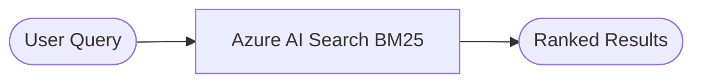

# Keyword Search

Keyword search uses Azure AI Search's built-in full-text engine (BM25) to match documents based on exact or near-exact word overlap between the query and indexed fields (`name`, `description`, `categories`).

## How it works



1. The query is tokenized and analyzed.
2. Azure AI Search scores each document using **BM25** — rewarding term frequency and penalizing very common words.
3. Results are ranked by score descending.

## Strengths

- Fast — no external API calls required.
- Works well when the user knows the exact product name or SKU.
- No embedding cost.

## Limitations

- Misses **semantic** matches: `"garden hose"` won't match `"outdoor watering pipe"`.
- Sensitive to spelling; stemming helps but synonym gaps remain.

## Code

**Script:** `zava_search_keyword.py`  
**Notebook:** `zava_search_keyword.ipynb`

```python
results = search_client.search(search_text=search_query, top=5)
```

## When to use

Use keyword search when users are searching by specific product names, model numbers, or exact phrases. Combine with vector or hybrid search when queries are natural-language or descriptive.
