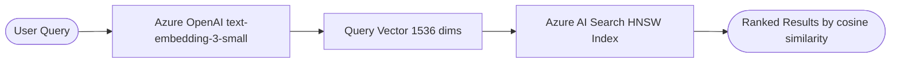

# Vector Search

Vector search converts both the query and indexed documents into high-dimensional embedding vectors using an OpenAI embedding model. Similarity is measured by **cosine distance** in vector space, allowing semantically related results to surface even without exact word overlap.

## How it works



1. The user's query is sent to the Azure OpenAI embedding model, producing a **1536-dimensional vector**.
2. Azure AI Search uses an **HNSW** (Hierarchical Navigable Small World) index to find the `k` nearest neighbours to the query vector across all product embeddings.
3. Results are ranked by cosine similarity score.

## HNSW index configuration

| Parameter | Value |
|---|---|
| Algorithm | HNSW |
| Metric | Cosine |
| Dimensions | 1536 |
| Profile | `embedding-profile` |

## Strengths

- Handles **natural language** and descriptive queries well.
- Finds semantically related products even with different wording.
- No dependency on exact keyword matches.

## Limitations

- Requires an OpenAI API call per query (latency + cost).
- May surface irrelevant results if the query is ambiguous.
- Misses exact keyword matches that fall outside the nearest-neighbour window.

## Code

**Script:** `zava_search_vector.py`  
**Notebook:** `zava_search_vector.ipynb`

```python
search_vector = openai_client.embeddings.create(
    model=os.environ["AZURE_OPENAI_EMBEDDING_DEPLOYMENT"], input=search_query
).data[0].embedding

results = search_client.search(
    None,
    top=5,
    vector_queries=[VectorizedQuery(vector=search_vector, k_nearest_neighbors=50, fields="embedding")]
)
```

## When to use

Use vector search when users express needs in natural language (e.g., *"something to water my garden without wasting water"*). Combine with keyword search via RRF for best overall precision.
