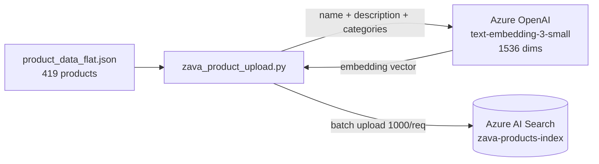
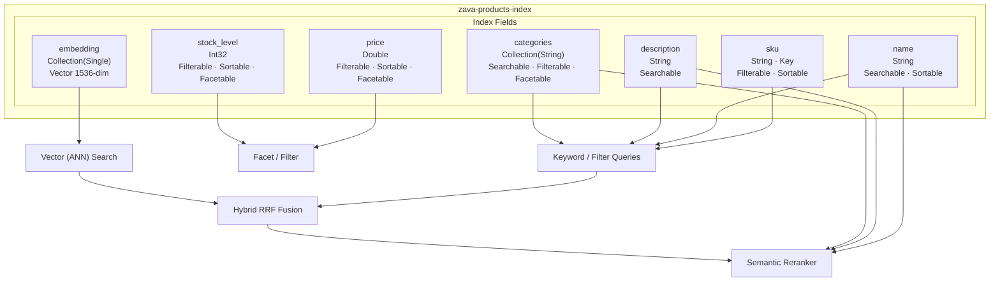
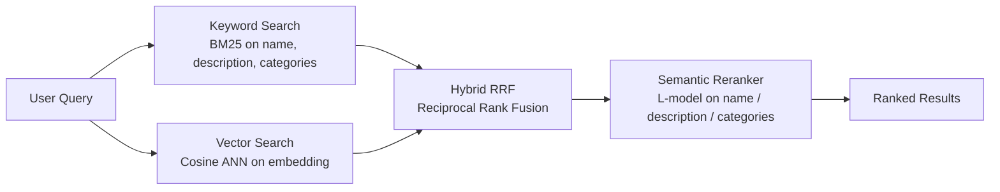

# Zava Product Data

## File

`product_data_flat.json` — flat JSON array of **419** hardware/home-improvement products used to populate the Azure AI Search demo index (`zava-products-index`).

---

## Index Schema

The index is defined in `zava_product_upload.py` via the Azure AI Search SDK. There are **7 fields** total: 6 data fields + 1 vector embedding field.

### Field Definitions

| Field | SDK Class | Azure Type | Key | Searchable | Filterable | Sortable | Facetable | Retrievable | Notes |
|---|---|---|:---:|:---:|:---:|:---:|:---:|:---:|---|
| `sku` | `SimpleField` | `String` | ✅ | ❌ | ✅ | ✅ | ❌ | ✅ | Primary key — must be unique |
| `name` | `SearchableField` | `String` | ❌ | ✅ | ❌ | ✅ | ❌ | ✅ | Full-text indexed; semantic **title** field |
| `description` | `SearchableField` | `String` | ❌ | ✅ | ❌ | ❌ | ❌ | ✅ | Full-text indexed; semantic **content** field |
| `price` | `SimpleField` | `Double` | ❌ | ❌ | ✅ | ✅ | ✅ | ✅ | Supports range filters & facet aggregation |
| `stock_level` | `SimpleField` | `Int32` | ❌ | ❌ | ✅ | ✅ | ✅ | ✅ | Supports range filters & facet aggregation |
| `categories` | `SearchField` | `Collection(String)` | ❌ | ✅ | ✅ | ❌ | ✅ | ✅ | Multi-value; semantic **keywords** field |
| `embedding` | `SearchField` | `Collection(Single)` | ❌ | ✅ (vector) | ❌ | ❌ | ❌ | ❌ | 1536-dim vector; not returned in results |

> **Retrievable** — All fields are retrievable by default in Azure AI Search unless `hidden=True` is set on the field. The `embedding` field is omitted from `select` in queries to avoid returning large float arrays.

---

### Field Capability Key

| Capability | What it enables |
|---|---|
| **Searchable** | Full-text BM25 tokenization (string fields) OR ANN vector similarity (vector fields) |
| **Filterable** | OData `$filter` expressions — exact match, range, `any()`/`all()` |
| **Sortable** | `$orderby` clause — ascending / descending sort on a single value |
| **Facetable** | `$facets` — count/bucket aggregation for navigation UI |
| **Key** | Unique document identifier; used for upsert / delete operations |

---

### Semantic Configuration

The index uses a **semantic configuration** named `products-semantic-config` that tells the L-model reranker which fields carry the most meaning:

| Semantic Role | Field |
|---|---|
| Title | `name` |
| Content | `description` |
| Keywords | `categories` |

---

### Vector Search Configuration

| Setting | Value |
|---|---|
| Algorithm | HNSW (`hnsw-config`) |
| Distance metric | Cosine similarity |
| Dimensions | 1536 |
| Embedding model | `text-embedding-3-small` (Azure OpenAI) |
| Profile name | `embedding-profile` |

The embedding is generated from a concatenation of all three text fields:

```python
text_to_embed = f"{product['name']} {product['description']} {' '.join(product['categories'])}"
```

---

## Data Schema

Each product record in `product_data_flat.json` has the following JSON shape (no `embedding` field — that is added at upload time):

| Field | JSON Type | Example |
|---|---|---|
| `sku` | `string` | `"HTHM001600"` |
| `name` | `string` | `"Professional Claw Hammer 16oz"` |
| `description` | `string` | `"High-quality steel claw hammer..."` |
| `price` | `number` | `28` |
| `stock_level` | `integer` | `25` |
| `categories` | `string[]` | `["HAND TOOLS", "HAMMERS"]` |

### Example Record

```json
{
  "sku": "HTHM001600",
  "name": "Professional Claw Hammer 16oz",
  "description": "High-quality steel claw hammer with comfortable fiberglass handle, perfect for framing and general construction work.",
  "price": 28,
  "stock_level": 25,
  "categories": ["HAND TOOLS", "HAMMERS"]
}
```

### Power Tool Example (higher price tier)

```json
{
  "sku": "PTCS000009",
  "name": "Track Saw",
  "description": "Precision track saw system for perfectly straight cuts in plywood and large panels.",
  "price": 350,
  "stock_level": 26,
  "categories": ["POWER TOOLS", "CIRCULAR SAWS"]
}
```

---

## Category Breakdown

Categories follow a two-level hierarchy: `[TOP_LEVEL, SUB_CATEGORY]`.

| Top-level Category | Sub-categories (examples) | Products |
|---|---|---|
| ELECTRICAL | SWITCHES, WIRING, OUTLETS | 48 |
| GARDEN & OUTDOOR | SPRINKLERS, PRUNING, IRRIGATION | 43 |
| HAND TOOLS | HAMMERS, SCREWDRIVERS, WRENCHES, PLIERS, MEASURING TOOLS | 31 |
| HARDWARE | FASTENERS, HINGES, LOCKS | 50 |
| LUMBER & BUILDING MATERIALS | LUMBER, SHEET GOODS, INSULATION | 50 |
| PAINT & FINISHES | PAINTS, PRIMERS, BRUSHES, ROLLERS | 51 |
| PLUMBING | PIPES, FITTINGS, VALVES | 48 |
| POWER TOOLS | DRILLS, CIRCULAR SAWS, SANDERS, JIGSAWS, GRINDERS, ROUTERS | 49 |
| STORAGE & ORGANIZATION | SHELVING, BINS, CABINETS | 49 |
| **Total** | | **419** |

---

## Architecture Diagrams

### Data Flow: JSON → Index



### Index Field Capabilities



### Search Query Modes



---

## How the Data is Used

1. **`zava_product_upload.py`** reads this file and creates an embedding per product by concatenating `name`, `description`, and `categories`.
2. Embeddings are generated via **`text-embedding-3-small`** (1536 dimensions, Azure OpenAI).
3. Products plus their embeddings are uploaded in batches of 1000 to the `zava-products-index` Azure AI Search index.
4. The index is queried by four search demo scripts/notebooks covering each search mode.

| Script | Search Mode |
|---|---|
| `zava_search_keyword.py` / `.ipynb` | BM25 keyword search |
| `zava_search_vector.py` / `.ipynb` | Pure vector (ANN) search |
| `zava_search_rrf.py` / `.ipynb` | Hybrid keyword + vector with RRF fusion |
| `zava_search_reranker.py` / `.ipynb` | Hybrid + semantic L-model reranker |

---

## Re-uploading Data

To re-upload after modifying this file:

```shell
cd sava-search
python zava_product_upload.py
```

This will:
1. Delete the existing `zava-products-index`
2. Recreate it with the correct schema (fields, vector config, semantic config)
3. Regenerate all 419 embeddings via Azure OpenAI
4. Upload all products in batches of 1000

### Required Environment Variables

```shell
AZURE_SEARCH_SERVICE=<your-service-name>
AZURE_SEARCH_API_KEY=<your-api-key>
AZURE_TENANT_ID=<your-tenant-id>
AZURE_OPENAI_SERVICE=<your-openai-service-name>
AZURE_OPENAI_API_KEY=<your-openai-api-key>
AZURE_OPENAI_EMBEDDING_DEPLOYMENT=<deployment-name>   # e.g. text-embedding-3-small
```

​	
